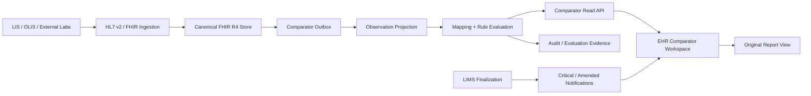

# Architecture Decision Document

_This document builds collaboratively through step-by-step discovery. Sections are appended as we work through each architectural decision together._

## Project Context Analysis

### Requirements Overview

**Functional Requirements:**

The comparator must let an authorized clinician select multiple laboratory reports and individual parameters, then review comparable observations longitudinally. It must preserve the performing laboratory's value, unit, reference interval, interpretation, status, source report, correction history, and provenance while presenting Roshi-derived deltas, range transitions, trends, classifications, and explanations separately.

The broader platform requires:
- FHIR R4 `DiagnosticReport`, `Observation`, `Specimen`, `ServiceRequest`, `Patient`, `Practitioner`, `PractitionerRole`, and `Organization` support.
- HL7 v2 and FHIR ingestion from LIMS, LifeLabs, Dynacare, OLIS, instruments, and external laboratories.
- pCLOCD/LOINC identity, UCUM units, Ontario/Canadian interoperability, and source attribution.
- LIMS result lifecycle management from preliminary through final, corrected/amended, cancelled, and entered-in-error.
- Critical-value notification and acknowledgement.
- Lab technician mapping/configuration workflows and manager approval of clinical rules.
- A clinician-facing comparator with table, trend, changes-only, source-report, reference-detail, and explanation views.

The repository already contains FHIR/HL7 ingestion, basic LIMS result APIs, critical-alert infrastructure, audit helpers, FHIR validation, and a Lab Results Intelligence UI prototype. The current UI still uses hard-coded demo panels and heuristic name matching, so it is not yet a canonical longitudinal comparator.

**Non-Functional Requirements:**

- PHIPA/PIPEDA privacy by design, Canadian data residency, consent-aware access, and immutable PHI auditability.
- WCAG 2.2 AA, AODA, Section 508 alignment, keyboard access, screen-reader semantics, and no colour-only clinical meaning.
- FHIR R4 conformance with Ontario/Canadian implementation-guide validation.
- Explicit separation of source laboratory interpretation from Roshi comparator classification and clinician decision.
- Explainability for every derived highlight, including rule ID/version, inputs, calculations, effective configuration, and evaluation time.
- Reliable handling of duplicate, late, corrected, amended, cancelled, and non-comparable observations.
- Fast clinician interaction over potentially large longitudinal histories, with predictable loading, empty, partial, and degraded states.
- Role-based access for clinicians, lab technicians, clinical approvers, external organizations, and administrators.

### Scale & Complexity

- Primary domain: full-stack clinical interoperability and decision-support UI.
- Complexity level: enterprise/high.
- Data complexity: high; numeric, qualitative, coded, panel, microbiology, reference-range, method, specimen, source, and versioned-result data.
- Integration complexity: high; multiple laboratories, OLIS, LIMS, FHIR, HL7 v2, terminology, notification, audit, and identity systems.
- Interaction complexity: high; multi-report and multi-parameter selection, comparability warnings, trends, source navigation, explanation panels, role-specific detail, and changes-only filtering.
- Estimated architectural components: source ingestion and normalization, canonical FHIR store, terminology/mapping registry, comparator domain and rule engine, explanation/read-model API, EHR UI, governance workflow, notification/audit pipeline, and observability/quality tooling.

### Technical Constraints & Dependencies

- FHIR R4 is the platform baseline; the existing lab profile must be brought into R4 alignment.
- Source observations remain authoritative. The comparator must not overwrite FHIR `Observation` or `DiagnosticReport` fields.
- Reference intervals need structured numeric bounds plus original narrative text and applicability metadata; text-only ranges are insufficient for safe calculations.
- Parameter equivalence cannot be implemented with display-name matching. It depends on approved codes, analyte/property/specimen/method identity, unit compatibility, and effective mapping versions.
- OLIS and external laboratory data must retain organization, source system, accession/report identifiers, received timestamps, and original reference information.
- LIMS verification and corrected-result workflows are dependencies for trustworthy comparator input.
- Terminology governance requires Morgan/Morgan-equivalent terminology review and Alex/FHIR SME review before activation.
- The existing EHR prototype must be treated as a presentation surface to migrate behind a server-backed contract, not as the owner of clinical comparison logic.

### Cross-Cutting Concerns Identified

- Source-of-truth and derived-data boundaries.
- Patient identity, tenant isolation, consent directives, and organization-scoped access.
- Result lifecycle, version lineage, supersession, and correction notification.
- Terminology and unit governance.
- Clinical safety, critical escalation, acknowledgement, and no-diagnosis language.
- Explainability, provenance, audit, and reproducibility of historical classifications.
- Accessibility, bilingual EN/FR readiness, responsive density, and role-specific information depth.
- Performance, caching, recomputation, idempotency, observability, and data-quality monitoring.
- Coordination across EHR, LIMS, FHIR, terminology, UX, UI, security, and clinical governance owners.

## Starter Template Evaluation

### Primary Technology Domain

Existing brownfield full-stack clinical platform: Next.js/React EHR frontend, Go LIMS and FHIR services, PostgreSQL-backed persistence, FHIR R4 interoperability, and shared clinical security/integration services.

### Starter Options Considered

**Option 1 - Existing healthcareworkspace foundation**

The repository already contains:
- Next.js App Router EHR structure.
- React and strict TypeScript.
- Tailwind-based design system and clinical components.
- ESLint, Vitest, and Playwright.
- Go services for LIMS and FHIR.
- PostgreSQL migrations, FHIR R4 resource storage, HL7 v2/FHIR ingestion, and service routing.

This option preserves existing deployment, authentication, routing, testing, FHIR, and multi-application conventions.

**Option 2 - New `create-next-app@latest` application**

The current official Next.js installation guidance uses `create-next-app@latest` and recommends TypeScript, ESLint, Tailwind, App Router, and the current Next.js defaults. It is appropriate for a new application but would duplicate and fragment the existing EHR foundation. It is rejected for this initiative.

**Option 3 - React Router/Vite or another standalone React starter**

This would create a separate client application and require new decisions for server rendering, authentication, FHIR access, audit boundaries, and deployment. It is rejected because the comparator belongs inside the existing EHR workflow.

**Option 4 - New standalone Go comparator service template**

A separate service could be useful later for scale, but introducing it before defining the comparator contract would move clinical logic away from the existing FHIR and governance boundaries. It is not selected as an initial starter.

### Selected Starter: Existing Healthcareworkspace Brownfield Baseline

**Rationale for Selection:**

The comparator is a cross-application clinical capability, not a new product shell. Reusing the existing foundation minimizes integration risk, preserves current identity and audit boundaries, and lets the implementation focus on the missing canonical read model, comparator domain, governance rules, and EHR experience.

**Initialization Command:**

None. Do not scaffold a new application. The first implementation story should create the comparator contract and server-backed vertical slice within the existing workspace.

**Architectural Decisions Provided by Existing Foundation:**

**Language & Runtime:**

- EHR: React 19.2.4, Next.js 16.2.6, TypeScript 5, and App Router.
- Services: Go modules with standard HTTP and Chi routing patterns.
- FHIR baseline: R4 / FHIR 4.0.1 resource semantics.
- Authorization direction: SMART on FHIR scopes and existing tenant/RBAC controls.

**Styling Solution:**

- Existing Tailwind CSS v4 and clinical design-system primitives.
- Preserve current healthcare tokens, compact density, focus states, skeleton loading, and responsive layout conventions.

**Build Tooling:**

- Existing Next.js build and development scripts.
- Existing Go module builds.
- Do not upgrade framework versions as part of comparator design; validate upgrades separately.

**Testing Framework:**

- EHR unit tests with Vitest.
- EHR browser tests with Playwright.
- Go tests for FHIR and LIMS packages.
- Add comparator domain, FHIR contract, API authorization, and end-to-end safety tests.

**Code Organization:**

- Keep source observations and reports in the canonical FHIR layer.
- Add comparator domain and read-model code behind a server/API boundary.
- Keep UI components focused on rendering and interaction state.
- Keep mapping, unit conversion, rule evaluation, explanation, and provenance logic outside React components.

**Development Experience:**

- Use existing `ehr`, `fhir`, and `lims` service boundaries.
- Maintain current agent instructions and local Next.js documentation.
- Use explicit contracts and fixtures so UI work can proceed against deterministic clinical examples without reintroducing hard-coded production data.

**Version verification note:**

Official sources checked on 2026-08-19: Next.js installation guidance reports version 16.3.1; Go release history reports Go 1.27.0; SMART App Launch reports 2.2.0 for FHIR R4; FHIR DiagnosticReport/Observation references are R4 4.0.1; WCAG 2.2 is the current W3C recommendation. Local dependency versions remain authoritative for this repository until separately upgraded.

## Core Architectural Decisions

### Decision Priority Analysis

**Critical Decisions (Block Implementation):**

- FHIR R4 resources remain the source of truth for laboratory reports and observations.
- Comparator classifications are derived data and are never written into source interpretation fields.
- A governed comparator read model is built from canonical FHIR resources and source provenance.
- Parameter equivalence and unit conversion require approved mappings/rules.
- Every displayed classification is reproducible from source version IDs, rule version, mapping version, and calculation inputs.
- All comparator reads and review actions use tenant, patient, organization, role, consent, and audit controls.

**Important Decisions (Shape Architecture):**

- Keep the first comparator domain implementation inside the existing FHIR/integration service boundary, with a separable Go package and API contract.
- Use PostgreSQL for canonical projection/configuration and Redis only for invalidation/read caching and real-time notification support.
- Use REST/JSON for EHR-facing comparator APIs and FHIR JSON for canonical resource exchange.
- Use URL-addressable selection state in the EHR and server-backed data loading; React components do not calculate clinical classifications.
- Use an outbox/event projection path so the comparator can be rebuilt after ingestion, mapping, or rule changes.

**Deferred Decisions (Post-MVP):**

- A separate horizontally scaled comparator service.
- LLM-generated clinical summaries or medication influence explanations.
- Generic microbiology, pathology, genomics, and complex qualitative comparison.
- Broad automatic unit conversion beyond explicitly approved analyte conversions.
- Cross-tenant population analytics and bulk comparison.
- Offline comparator access.

### Data Architecture

**Canonical model:**

- `DiagnosticReport` represents report-level context, status, organization, performer, specimen, order relationship, identifiers, issued time, conclusion, and atomic result references.
- `Observation` represents each atomic laboratory result, including `value[x]`, `unit`, `interpretation`, `referenceRange`, `effective[x]`, `issued`, `performer`, `specimen`, `method`, status, notes, and source identifiers.
- `Specimen`, `ServiceRequest`, `Patient`, `PractitionerRole`, and `Organization` are resolved through FHIR references.
- `Provenance` and source extensions/identifiers preserve origin and lifecycle lineage.

**Derived comparator model:**

The FHIR service owns a relational projection with these logical aggregates:

- `lab_observation_fact`: source resource ID/version, patient, report, code systems, analyte identity, specimen, method, value type, original value/unit, normalized value/unit, source interpretation, status, source organization, accession, effective/issued times, and reference-range JSON.
- `parameter_mapping`: local/source code, LOINC, pCLOCD, analyte/property/specimen/method identity, equivalence status, confidence, effective period, reviewer, approval, and superseded version.
- `unit_conversion_rule`: source/target UCUM units, analyte identity, conversion formula/version, precision policy, approval, and effective period.
- `comparator_rule`: rule ID/version, eligible parameter group, numeric/qualitative logic, minimum absolute delta, percentage delta, time window, range-crossing behavior, critical precedence, and approval lifecycle.
- `comparison_evaluation`: evaluation ID, patient, parameter group, source current/previous observation versions, selected report set hash, mapping/rule versions, normalized calculations, range transition, comparator status, rationale facts, evaluated time, and engine version.
- `comparator_review`: reviewer, evaluation/report/observation references, action, acknowledgement time, note, and audit correlation ID.
- `comparator_outbox`: idempotent projection and cache-invalidation events.

The projection is rebuildable. It is not a second source of truth.

**Validation and migration:**

- Reject or quarantine observations that lack safe identity, value semantics, or required provenance.
- Retain original source payloads and normalized FHIR resources for replay.
- Add migrations incrementally; never rewrite existing source values to fit comparator needs.
- Use immutable version rows or source version references for corrected/amended results.

**Caching:**

- Cache only authorized, tenant-scoped read models.
- Key cache entries by tenant, patient, selected report-set hash, parameter-set hash, rule version, mapping version, and source projection revision.
- Invalidate on new final/amended/corrected/entered-in-error result, mapping activation, rule activation, or consent change.
- Never treat cached comparator output as fresher than the source revision it names.

### Authentication & Security

- Use the existing authenticated EHR session and tenant context for first-party access.
- Align FHIR access with SMART scopes such as patient-scoped `Observation`/`DiagnosticReport` reads and role-specific write scopes.
- Enforce RBAC/ABAC server-side for clinician, nurse, lab technician, clinical approver, external organization, and administrator operations.
- Apply consent directives and organization boundaries before building the comparator read model response.
- Keep source PHI and derived comparison data within Canadian-resident infrastructure for Ontario deployments.
- Encrypt data in transit with TLS and at rest using platform-managed key material.
- Audit comparator open, source access, report/parameter selection, explanation access, original-report access, acknowledgement, export, mapping change, rule change, approval, and manual override.
- Avoid sending patient-identifiable data to an external AI service in the MVP.

### API & Communication Patterns

Use REST with JSON for the EHR comparator contract and FHIR JSON for canonical resources.

Suggested FHIR/integration endpoints:

- `GET /lab/comparator/patients/{patientId}/reports`
- `GET /lab/comparator/patients/{patientId}/parameters`
- `POST /lab/comparator/patients/{patientId}/compare`
- `GET /lab/comparator/evaluations/{evaluationId}`
- `GET /lab/comparator/source/{resourceType}/{id}`
- `POST /lab/comparator/reviews`
- `GET /lab/comparator/governance/mappings`
- `GET /lab/comparator/governance/rules`
- `POST /lab/comparator/governance/{mapping|rule}/{id}/submit`
- `POST /lab/comparator/governance/{mapping|rule}/{id}/approve`

The EHR may expose same-origin proxy routes such as `/api/patients/{patientId}/lab-comparator` so browser code does not hold service credentials.

Responses must include source resources and versions, source interpretation and comparator status as separate fields, original and normalized values, comparability state and warnings, reference interval at each observation, provenance and source organization, explanation facts and rule/mapping versions, a projection revision, and generated timestamp.

Use consistent `application/problem+json` errors with a stable error code, user-safe message, retryability, and correlation ID.

### Frontend Architecture

- Use a server-rendered route for patient and initial comparator data, with a client workspace for selection and view changes.
- Keep report selection, parameter selection, view mode, period, and filters in URL state where practical.
- Use React state for ephemeral panel state only; do not duplicate comparator calculations in the browser.
- Use deferred search and transitions for large lists, but keep selected state stable during loading.
- Build reusable components for report picker, parameter picker, comparison table, result status pair, mini-trend, explanation panel, provenance panel, source-report link, warning banner, and review action.
- Keep clinician, technician, and governance detail as presentation modes over the same response contract.
- Use semantic table markup for comparisons and an accessible text summary for charts.
- Enforce loading, empty, partial, stale, non-comparable, corrected, cancelled, and error states as first-class component states.

### Infrastructure & Deployment

- Deploy first within existing EHR/FHIR/LIMS Docker/Kubernetes boundaries.
- Run projection and outbox processing as an existing-service worker or small Go worker package before creating a new deployable service.
- Use PostgreSQL transactions for source projection and outbox writes.
- Use Redis for cache invalidation, notification fan-out, and short-lived coordination only.
- Use existing FHIR server validation and tenant middleware; add comparator contract tests at the service boundary.
- Monitor projection lag, source-to-projection reconciliation, mapping coverage, missing reference ranges, non-comparable rates, API latency, cache hit rate, and critical-result acknowledgement latency.
- Maintain structured logs without raw PHI; use correlation IDs and resource identifiers subject to privacy policy.

### Decision Impact Analysis

**Implementation Sequence:**

1. Define and review FHIR/JSON comparator contract.
2. Correct FHIR R4 lab profile and source metadata requirements.
3. Add structured observation/reference-range/provenance projection.
4. Add mapping and conversion registries with draft/approval lifecycle.
5. Implement deterministic comparison engine and explanation facts.
6. Expose patient comparator read/review APIs with authorization and audit.
7. Replace hard-coded EHR data with the API-backed vertical slice.
8. Add critical/amended refresh and review workflows.
9. Add governance UI and quality dashboard.
10. Expand qualitative and specialized domains only after domain-specific rules exist.

**Cross-Component Dependencies:**

- FHIR ingestion must preserve source metadata before comparator projection is reliable.
- Terminology approval gates equivalence and parameter selection.
- LIMS finalization/correction workflows gate source status and alert correctness.
- Comparator rule approval gates clinical highlighting.
- EHR UI cannot claim a meaningful comparison when projection, mapping, or reference data is incomplete.
- Audit and consent middleware must run before comparator APIs are exposed to users.

## Implementation Patterns & Consistency Rules

### Pattern Categories Defined

**Critical Conflict Points Identified:**

There are 12 areas where agents could make incompatible choices: naming, file placement, API paths, response envelopes, error formats, date/time handling, FHIR/source provenance, event payloads, state ownership, loading/error behavior, authorization/audit, and test fixtures.

### Naming Patterns

**Database Naming Conventions:**

- Use lowercase plural snake_case table names: `lab_observation_facts`, `comparator_rules`.
- Use snake_case columns: `patient_id`, `source_resource_version`, `effective_at`.
- Use `_id` for identifiers, `_at` for timestamps, `_date` for date-only values, and `_version` for immutable versions.
- Use `idx_<table>_<columns>` for indexes and `<table>_<business_key>_uidx` for unique indexes.
- Never encode clinical meaning into a database column name when a governed code or status field is appropriate.

**API Naming Conventions:**

- Use plural resource nouns and lowercase paths: `/lab/comparator/patients/{patientId}/reports`.
- Use camelCase JSON fields at TypeScript and service boundaries, except native FHIR fields, which follow FHIR naming exactly.
- Use path parameters in `{patientId}` style in Go route declarations and `patientId` in JavaScript/TypeScript.
- Use query parameters for filters and pagination: `status`, `source`, `from`, `to`, `limit`, `cursor`.
- Use standard headers plus `X-Correlation-ID` only where the existing gateway requires it; do not invent per-feature headers.

**Code Naming Conventions:**

- TypeScript components and types use PascalCase: `ComparisonTable`, `ComparisonResult`.
- TypeScript variables, functions, hooks, and props use camelCase: `selectedReportIds`, `useLabComparator`.
- Go packages use short lowercase names; exported types/functions use PascalCase; local variables use camelCase.
- Files follow local conventions: PascalCase for React component files where already established, lowercase for route and Go files.
- Use domain vocabulary consistently: `sourceInterpretation`, `comparatorStatus`, `referenceRange`, `comparisonEvaluation`, `mappingVersion`.
- Do not use ambiguous names such as `status`, `value`, or `result` without a domain qualifier at API boundaries.

### Structure Patterns

**Project Organization:**

- EHR route handlers stay under `ehr/src/app/api`.
- EHR comparator UI stays under a feature boundary such as `ehr/src/features/lab-comparator` or the established components boundary; do not spread comparator logic across unrelated patient cards.
- FHIR comparator domain code stays under `fhir/internal/labcomparator`.
- FHIR ingestion remains under `fhir/internal/labingestion`.
- Mapping/rule persistence and evaluation belong to the comparator domain, not React components or generic FHIR handlers.
- Shared clinical primitives belong in the existing EHR design system only after a second use case confirms the abstraction.

**Test Organization:**

- Co-locate TypeScript unit tests as `*.test.ts` or `*.test.tsx` beside pure domain utilities when local conventions allow.
- Keep Playwright workflows under `ehr/tests/e2e`.
- Keep Go tests beside packages using `_test.go`.
- Put reusable FHIR and comparator fixtures under explicit test fixture directories; never use production mock patient data as a safety fixture.
- Every comparator rule fixture must include source observations, reference ranges, mappings, expected status, expected explanation facts, and a rule version.

**File Structure Patterns:**

- Keep configuration in service-specific config packages and environment variables; do not read process environment directly from domain logic.
- Keep documentation in `docs/` or the relevant planning artifact; link to source documents instead of copying large standards.
- Keep generated FHIR examples and test payloads separate from runtime code.
- Do not add a second route for the same comparator behavior; choose one canonical EHR entry route and redirect legacy links.

### Format Patterns

**API Response Formats:**

- FHIR endpoints return native FHIR resources or FHIR Bundles.
- Comparator endpoints return an explicit envelope: `{ data, warnings, meta }`.
- `data` contains the domain response; `warnings` is always an array; `meta` contains `projectionRevision`, `generatedAt`, `correlationId`, and pagination when applicable.
- Collections use arrays even when empty.
- Do not return `null` where an empty array or explicit `notAvailable` state communicates better semantics.

**Error Response Formats:**

- Use `application/problem+json` with `type`, `title`, `status`, `code`, `detail`, `retryable`, and `correlationId`.
- Validation errors add `fieldErrors` with stable field keys.
- Never expose stack traces, raw SQL, access tokens, or source payloads in user-facing errors.
- Distinguish `notComparable`, `missingReferenceRange`, `mappingPending`, `sourceUnavailable`, `staleProjection`, and `forbidden` as stable codes.

**Date and Numeric Formats:**

- APIs exchange timestamps as ISO 8601/RFC 3339 with timezone or UTC `Z`.
- Store instants in UTC; preserve source timezone/offset when clinically relevant.
- The UI renders the user's clinical timezone and shows the timezone when a time could affect interpretation.
- Use decimal-safe numeric handling; do not calculate through localized display strings.
- Preserve original precision and display precision separately.
- A normalized value never replaces the original value/unit.

**FHIR and Provenance Formats:**

- Preserve native FHIR element names and cardinalities.
- Keep source interpretation in `Observation.interpretation`; keep comparator status in the derived response/evaluation.
- Preserve every historical reference range attached to its source observation.
- Use resource IDs, `meta.versionId` where available, accession identifiers, and provenance references to identify exact source versions.

### Communication Patterns

**Event System Patterns:**

- Use lowercase dot-separated event names with explicit versions: `lab.result.finalized.v1`, `lab.result.corrected.v1`, `comparator.projection.updated.v1`.
- Event envelopes contain `eventId`, `eventType`, `eventVersion`, `occurredAt`, `tenantId`, `correlationId`, `causationId`, and `data`.
- Events carry identifiers and safe metadata; avoid raw PHI unless the receiving channel is explicitly PHI-authorized.
- Consumers must be idempotent using event ID plus source version or business key.
- Publish after the source transaction commits through an outbox, not directly from a request handler.

**State Management Patterns:**

- Server data is authoritative; client state represents selection, view, filters, and pending interaction only.
- URL state is canonical for patient, report IDs, parameter IDs, view, period, and filter state.
- Use immutable updates and functional state transitions.
- Do not maintain a second client-side copy of comparator classifications.
- Use explicit action names such as `selectReport`, `clearReports`, `setViewMode`, `acknowledgeComparison`.
- Use transitions/deferred values for responsiveness, not for hiding data freshness.

### Process Patterns

**Authentication and Audit:**

- Enforce access on the server before reading source observations or derived evaluations.
- Every read/action requiring audit uses the existing audit helper or service contract with actor, patient, entity, action, outcome, and correlation ID.
- Do not rely on hidden UI controls for authorization.
- Record review/acknowledgement and export as distinct clinical actions.

**Error Handling:**

- Map transport errors to domain errors at the API boundary.
- Retry only safe GETs and idempotent projection/outbox operations.
- Do not automatically retry writes that could create duplicate review, acknowledgement, or export actions.
- Show a user-safe message, preserve available data, identify stale/partial state, and offer a specific recovery action.
- Log technical detail server-side with correlation ID and no raw PHI.

**Loading States:**

- Use `isLoading` for initial data, `isRefreshing` for an existing view being refreshed, `isSubmitting` for user writes, and `isProjecting` for governance/projection operations.
- Use skeletons for initial layout; use inline progress indicators for refreshes and writes.
- Do not replace already displayed clinical data with a blank spinner during refresh.
- Announce status changes with accessible status messages without stealing focus.

**Validation Timing:**

- Validate request shape at the boundary.
- Validate FHIR conformance before persistence.
- Validate mapping/rule eligibility before evaluation.
- Return warnings for incomplete but displayable data; block calculations that would be misleading.
- Keep clinical policy validation in the governed comparator domain, not in UI form code.

### Enforcement Guidelines

**All AI Agents MUST:**

- Keep source and derived fields separate.
- Use the established naming, response, error, date, event, and test patterns.
- Add a focused test fixture for every new comparison rule or edge case.
- Preserve existing user changes and inspect local `AGENTS.md` instructions before editing.
- Run the narrowest relevant test and lint/type check after each implementation slice.
- Link comparator output to source resource/version IDs and rule/mapping versions.
- Treat missing or non-comparable data as an explicit state.

**Pattern Enforcement:**

- Validate API shapes with contract tests and representative FHIR fixtures.
- Validate database naming and migrations during review.
- Add pattern violations and unresolved exceptions to the architecture decision record or implementation story.
- Update this section when a cross-feature pattern changes; do not silently create local exceptions.
- Require FHIR SME and terminology review for changes to resource mapping, codes, units, or comparator eligibility.

### Pattern Examples

**Good Examples:**

- `sourceInterpretation: "HH"` beside `comparatorStatus: "critical"`.
- `GET /lab/comparator/patients/patient-001/reports`.
- `referenceRange: { low: 3.5, high: 5.0, text: "3.5-5.0 mmol/L", sourceObservationId: "obs-123" }`.
- `warnings: [{ code: "referenceChanged", detail: "..." }]`.
- `lab.result.corrected.v1` with `sourceVersionId` and `supersedesVersionId`.

**Anti-Patterns:**

- `status: "critical"` with no indication whether the laboratory or comparator generated it.
- Comparing `Creatinine` and `Creatinine urine` because names contain the same word.
- Parsing `"< 5.0 mmol/L"` in a React component to decide abnormality.
- Replacing an old observation's reference range with the newest range.
- Returning HTTP 200 with `{ error: "failed" }` for authorization or data failures.
- Logging full FHIR payloads containing patient identifiers.
- Hiding all non-changed results with no visible way to restore the full table.

## Project Structure & Boundaries

### Complete Project Directory Structure

```text
healthcareworkspace/
??? AGENTS.md
??? docs/
?   ??? project-context.md
?   ??? lab-results-intelligence.spec.md
?   ??? lab-comparator-technical-design.md
?   ??? lab-comparator-ux-design.md
?   ??? designs/
?   ?   ??? P0-4_lab_result_verify_workflow_design.md
?   ?   ??? P1-3_lims_to_ehr_critical_alerts_design.md
?   ?   ??? P2-2_lab_tech_ui_design.md
?   ?   ??? P2-5_admin_audit_design.md
?   ?   ??? P3-2_terminology_design.md
?   ??? sdlc/
??? ehr/
?   ??? src/
?   ?   ??? app/
?   ?   ?   ??? dashboard/records/[id]/labs/page.tsx
?   ?   ?   ??? dashboard/records/labs/page.tsx
?   ?   ?   ??? dashboard/records/[id]/labs/[labId]/page.tsx
?   ?   ?   ??? api/
?   ?   ?       ??? patients/[patientId]/lab-comparator/route.ts
?   ?   ??? features/
?   ?   ?   ??? lab-comparator/
?   ?   ?       ??? api-types.ts
?   ?   ?       ??? comparator-page.server.tsx
?   ?   ?       ??? comparator-workspace.client.tsx
?   ?   ?       ??? components/
?   ?   ?       ?   ??? ComparatorHeader.tsx
?   ?   ?       ?   ??? ReportSelectionPanel.tsx
?   ?   ?       ?   ??? ParameterSelectionPanel.tsx
?   ?   ?       ?   ??? ComparisonToolbar.tsx
?   ?   ?       ?   ??? ComparisonTable.tsx
?   ?   ?       ?   ??? ComparisonRow.tsx
?   ?   ?       ?   ??? SourceStatusPair.tsx
?   ?   ?       ?   ??? TrendView.tsx
?   ?   ?       ?   ??? ChangesOnlyView.tsx
?   ?   ?       ?   ??? ExplanationPanel.tsx
?   ?   ?       ?   ??? ProvenancePanel.tsx
?   ?   ?       ?   ??? ReferenceChangeNotice.tsx
?   ?   ?       ?   ??? ComparabilityWarning.tsx
?   ?   ?       ?   ??? OriginalReportLink.tsx
?   ?   ?       ?   ??? ComparatorStates.tsx
?   ?   ?       ??? state/
?   ?   ?       ?   ??? comparatorQueryState.ts
?   ?   ?       ?   ??? comparatorReducer.ts
?   ?   ?       ??? formatters/
?   ?   ?       ?   ??? comparisonDisplay.ts
?   ?   ?       ?   ??? sourceLabels.ts
?   ?   ?       ??? __tests__/
?   ?   ?           ??? comparatorQueryState.test.ts
?   ?   ?           ??? comparisonDisplay.test.ts
?   ?   ??? lib/
?   ?   ?   ??? labComparatorClient.ts
?   ?   ?   ??? audit.ts
?   ?   ??? types/
?   ?       ??? labComparator.ts
?   ??? tests/
?   ?   ??? e2e/lab-comparator.spec.ts
?   ?   ??? fixtures/lab-comparator/
?   ?       ??? chemistry-multi-report.json
?   ?       ??? cross-laboratory.json
?   ?       ??? corrected-result.json
?   ?       ??? non-comparable.json
?   ?       ??? qualitative-result.json
?   ??? public/
??? fhir/
?   ??? internal/
?   ?   ??? labcomparator/
?   ?   ?   ??? domain.go
?   ?   ?   ??? types.go
?   ?   ?   ??? handler.go
?   ?   ?   ??? service.go
?   ?   ?   ??? repository.go
?   ?   ?   ??? projection.go
?   ?   ?   ??? evaluator.go
?   ?   ?   ??? explanation.go
?   ?   ?   ??? governance.go
?   ?   ?   ??? authorization.go
?   ?   ?   ??? mapper.go
?   ?   ?   ??? *_test.go
?   ?   ??? labingestion/
?   ?   ??? fhirstore/
?   ?   ??? fhirsearch/
?   ?   ??? validator/
?   ?   ??? authmw/
?   ??? migrations/
?   ?   ??? 00005_lab_comparator.sql
?   ??? test/
?       ??? comparator_contract_test.go
?       ??? fixtures/lab-comparator/
??? lims/
?   ??? internal/
?   ?   ??? handler/results.go
?   ?   ??? store/store.go
?   ?   ??? notifications/
?   ??? migrations/
?   ?   ??? 00002_lab_result_lineage.sql
?   ??? internal/handler/*_test.go
??? _bmad-output/
    ??? planning-artifacts/
        ??? architecture.md
        ??? ux-design-specification.md
```

Files marked by the comparator feature boundary are new. Existing EHR and service files should be extended only where they own the relevant behavior.

### Architectural Boundaries

**API Boundaries:**

- Browser to EHR: same-origin `/api/patients/{patientId}/lab-comparator`.
- EHR to FHIR comparator: authenticated internal REST calls.
- FHIR comparator to canonical FHIR store: repository interfaces, never direct handler-to-database access.
- LIMS to FHIR: finalized/corrected result exchange through the existing integration path.
- FHIR to EHR notifications: existing critical-result/SSE channel with comparator refresh metadata.
- Original reports: one canonical route, `/dashboard/records/{patientId}/labs/{labId}`, with legacy route redirects.

**Component Boundaries:**

- Selection components manage user intent and URL state.
- Comparison components render the API contract and never determine clinical significance.
- Explanation and provenance components display supplied evidence.
- Trend components render numeric points and accessible text summaries.
- Review controls call server actions/API routes and report audit outcomes.
- Shared design-system components remain generic; comparator-specific clinical semantics stay in the feature.

**Service Boundaries:**

- LIMS owns order/result lifecycle, verification, amendment, and critical-result emission.
- FHIR ingestion owns message parsing, patient matching, normalization, FHIR persistence, and source provenance.
- FHIR comparator owns mapping, comparability, unit conversion approval, rule evaluation, explanation facts, projection, and comparator governance.
- EHR owns clinician workflow, patient context, selection state, rendering, and navigation.
- Audit/notification infrastructure owns delivery and audit persistence; comparator emits typed actions/events.

**Data Boundaries:**

- Canonical FHIR resources are immutable source facts except through normal FHIR versioned update semantics.
- Comparator projection tables are rebuildable and never authoritative over source resources.
- Governance tables are tenant- and organization-scoped and versioned.
- Cache entries are derived, time-bounded, and invalidated by source/configuration revisions.
- Raw inbound messages remain in the ingestion audit/replay boundary and are not sent to browser clients.

### Requirements to Structure Mapping

**Comparator business requirements BR-001 to BR-005:**

- Report and parameter selection: EHR `ReportSelectionPanel`, `ParameterSelectionPanel`, FHIR reports/parameters endpoints.
- Source values, interpretations, and references: FHIR projection and `SourceStatusPair`.
- Tests: EHR component tests and FHIR contract fixtures.

**Comparator business requirements BR-006 to BR-010:**

- Numeric delta, significance, critical precedence, and explanations: `fhir/internal/labcomparator/evaluator.go`, `explanation.go`, `ComparisonEvaluation`.
- Table/trend/changes-only display: EHR comparison components.
- Reference changes: FHIR response warnings and EHR `ReferenceChangeNotice`.

**Comparator business requirements BR-011 to BR-015:**

- Provenance and original reports: `ProvenancePanel`, `OriginalReportLink`, source endpoint, FHIR resource/version references.
- Unit normalization and non-comparable states: `mapper.go`, conversion registry, `ComparabilityWarning`.
- Corrected/amended results: LIMS lineage migration, ingestion projection, correction state components.

**Comparator business requirements BR-016 to BR-020:**

- Rule/mapping approval: `governance.go`, governance endpoints, manager UI added under an administration feature boundary.
- Audit/accessibility/no-diagnosis: shared audit/auth middleware, design-system status patterns, UX content and API contract rules.

**Existing platform stories:**

- DR-006 lab result review: EHR comparator feature plus FHIR `labcomparator`.
- P0-4 verification: LIMS result handler/store and finalization tests.
- P1-3 critical alerts: LIMS notifications and EHR alert route/SSE.
- P2-2 lab technician UI: EHR lab workflow feature and LIMS proxies.
- P2-5 audit: EHR audit API and comparator audit actions.
- P3-2 terminology: terminology registry and mapping approval dependencies.

### Integration Points

**Internal Communication:**

- Server components call the EHR comparator client.
- EHR route handlers validate session, patient scope, and query parameters before calling FHIR.
- FHIR handlers validate request DTOs and delegate to comparator services.
- Comparator services call repository interfaces and emit outbox records within transactions.
- Projection workers consume outbox events idempotently.
- UI actions return typed success/error responses and refresh URL-addressable state.

**External Integrations:**

- OLIS and external laboratory feeds enter through FHIR lab ingestion.
- LifeLabs, Dynacare, instrument, and FHIR Push source metadata is retained in ingestion and observation projection.
- pCLOCD/LOINC terminology services populate mapping candidates; approval remains local governance.
- SMART/ONE ID and tenant auth determine access context.
- LIMS provides result status, interpretation, correction, and accession data.
- Redis/SSE provides critical-result and refresh notifications.

**Data Flow:**



### File Organization Patterns

**Configuration Files:**

- Service configuration stays in existing Go config packages and environment examples.
- Comparator policy values are database-managed governed records, not environment variables.
- EHR feature configuration stays in typed modules; no clinical thresholds in CSS or client constants.

**Source Organization:**

- Domain logic is isolated from transport handlers.
- Repositories expose typed methods, not SQL strings to handlers.
- UI formatting is isolated from API client and domain evaluation.
- FHIR conversion stays at the FHIR boundary and preserves native resource shape.

**Test Organization:**

- Unit tests cover evaluation, mapping, conversion, explanation, state transitions, and display formatting.
- Contract tests cover request/response shape, source/derived separation, warning codes, and authorization.
- Integration tests cover ingestion-to-projection and correction lineage.
- Playwright covers report selection, parameter selection, changes-only reversibility, source navigation, critical display, and keyboard access.

**Asset Organization:**

- Use existing design-system icons and assets.
- Do not add clinical meaning through decorative imagery.
- Store test-only FHIR payloads under fixture directories, never under `public`.

### Development Workflow Integration

**Development Server Structure:**

- EHR runs through existing Next.js scripts.
- FHIR and LIMS run through existing Go service commands.
- Local fixtures can seed deterministic comparator data without changing production source paths.
- Service URLs and tokens come from existing environment configuration.

**Build Process Structure:**

- EHR lint, unit, and Playwright checks run through existing scripts.
- FHIR and LIMS run `go test ./...` and build checks.
- Comparator contract fixtures are validated in CI before UI integration tests.
- Database migrations run in service-specific migration order.

**Deployment Structure:**

- Deploy EHR, FHIR, and LIMS using existing Docker/Kubernetes boundaries.
- Apply FHIR/comparator migrations before enabling the comparator route.
- Enable feature flags by tenant/organization during pilot rollout.
- Monitor projection lag and data-quality metrics before broad activation.

## Architecture Validation Results

### Coherence Validation

**Decision Compatibility:**

The brownfield Next.js/React EHR, Go FHIR/LIMS services, PostgreSQL projection, Redis invalidation path, FHIR R4 resource model, REST comparator contract, and SMART/RBAC controls are compatible. No new framework or standalone service is required for the first vertical slice.

The local EHR dependency versions remain authoritative. The current Next.js documentation version difference is documentation currency, not a runtime conflict, and no unplanned upgrade is introduced.

**Pattern Consistency:**

The patterns enforce the source/derived boundary, native FHIR naming, camelCase comparator JSON, versioned events, UTC storage, explicit warnings, server-owned classifications, and audited writes. They align with the chosen service and frontend structure.

**Structure Alignment:**

The proposed EHR feature boundary, FHIR `labcomparator` package, LIMS lifecycle boundary, projection/outbox path, and fixture/test layout support the decisions. The original-report route is explicitly canonicalized to prevent the currently observed broken source link.

### Requirements Coverage Validation

**Epic/Feature Coverage:**

DR-006 is covered by the FHIR comparator API, EHR workspace, trends, critical state, acknowledgement, source navigation, and corrected-result lineage. P0-4, P1-3, P2-2, P2-5, and P3-2 are represented as dependencies or integration boundaries rather than duplicated inside the comparator.

**Functional Requirements Coverage:**

BR-001 through BR-020 are mapped to report/parameter selection, source preservation, numeric and qualitative handling, rule evaluation, provenance, original-report navigation, governance, audit, accessibility, and safety language. Multi-report and multi-parameter selection are explicit; the existing one-result modal is not treated as sufficient.

**Non-Functional Requirements Coverage:**

PHIPA/PIPEDA, Canadian residency, tenant/consent/RBAC boundaries, WCAG 2.2 AA/AODA, FHIR R4, pCLOCD/LOINC/UCUM, auditability, reproducibility, source attribution, correction lineage, cache invalidation, projection monitoring, and no-diagnosis language are addressed at the architecture level.

### Implementation Readiness Validation

**Decision Completeness:**

Source ownership, derived storage, rule/mapping governance, API style, security, frontend ownership, deployment boundary, cache policy, event pattern, and first implementation sequence are documented.

**Structure Completeness:**

The tree names the EHR route/API boundary, feature components, FHIR domain package, LIMS lineage migration, governance surfaces, fixtures, contract tests, and end-to-end tests.

**Pattern Completeness:**

Naming, file placement, JSON/FHIR formats, errors, dates, events, state ownership, retries, loading states, validation, authorization, audit, and enforcement are specified with examples and anti-patterns.

### Gap Analysis Results

**Critical Gaps:**

None in the architecture for the MVP vertical slice. Clinical highlighting must remain disabled for unmapped or unapproved parameters and rules; this is an activation precondition, not an unresolved design decision.

**Important Gaps:**

- The exact comparator API JSON Schema/OpenAPI contract still needs to be authored and reviewed.
- The Ontario/Canadian FHIR profile differential and source metadata extension set still need Alex/FHIR SME sign-off.
- The initial approved parameter groups, reference-range applicability policy, and unit conversions still need Morgan/terminology and clinical governance sign-off.
- The SMART scope matrix, consent-directive behavior, and external-organization policy matrix need security/privacy review.
- Concrete P95 latency, projection-lag, retention, and availability targets need product/operations agreement.
- OLIS query/response behavior and corrected-result lineage need an integration contract test suite.

**Nice-to-Have Gaps:**

- Dedicated comparator data-quality dashboard.
- Feature-flagged tenant rollout and operational runbook.
- Formal charting-library decision.
- Population-level comparison and advanced export formats.
- Additional qualitative, microbiology, pathology, and genomics profiles.

### Validation Issues Addressed

- Replaced the mock-data boundary with an explicitly server-backed comparator architecture.
- Separated source laboratory status from Roshi comparator status.
- Added rebuildable projection and versioned evaluation evidence.
- Added explicit non-comparable and missing-reference states.
- Added canonical original-report navigation and route correction.
- Added audit, consent, role, tenant, and organization boundaries.
- Added specific tests for correction, critical precedence, mapping, unit conversion, and accessibility.

### Architecture Completeness Checklist

**Requirements Analysis**

- [x] Project context thoroughly analyzed
- [x] Scale and complexity assessed
- [x] Technical constraints identified
- [x] Cross-cutting concerns mapped

**Architectural Decisions**

- [x] Critical decisions documented with versions
- [x] Technology stack fully specified
- [x] Integration patterns defined
- [x] Performance considerations addressed

**Implementation Patterns**

- [x] Naming conventions established
- [x] Structure patterns defined
- [x] Communication patterns specified
- [x] Process patterns documented

**Project Structure**

- [x] Complete directory structure defined
- [x] Component boundaries established
- [x] Integration points mapped
- [x] Requirements to structure mapping complete

### Architecture Readiness Assessment

**Overall Status:** READY FOR IMPLEMENTATION for the MVP vertical slice, subject to the important governance and contract gates above.

**Confidence Level:** High for system boundaries and implementation sequencing; medium for jurisdiction-specific profile and clinical-rule details pending SME approval.

**Key Strengths:**

- Clear source-of-truth versus derived-data boundary.
- Rebuildable, explainable comparator model.
- Explicit clinical safety and non-comparability behavior.
- Concrete EHR/FHIR/LIMS boundaries.
- Consistent agent implementation patterns.
- Strong provenance, audit, correction, and accessibility coverage.

**Areas for Future Enhancement:**

- Complete OpenAPI/JSON Schema and FHIR profile packages.
- Add governance dashboards and operational quality metrics.
- Introduce a separate comparator service only when measured scale requires it.
- Add specialized domain rules only with domain-owner approval.

### Implementation Handoff

**AI Agent Guidelines:**

- Follow the source/derived boundary exactly.
- Never calculate clinical classification in React.
- Never compare by display name alone.
- Preserve original values, units, ranges, interpretations, organizations, and versions.
- Make warnings and non-comparable states explicit.
- Add focused tests before expanding the feature slice.
- Coordinate FHIR changes with Alex and terminology changes with Morgan.

**First Implementation Priority:**

Define and approve the comparator contract, then implement one end-to-end chemistry slice: canonical source fixture -> structured projection -> approved mapping -> deterministic evaluation -> authorized API -> EHR table/trend/explanation/source navigation.
