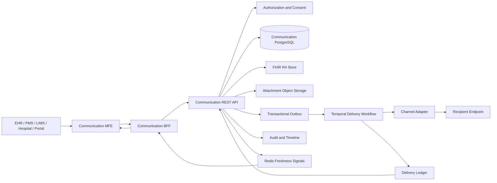

# Architecture Decision Document

_This document builds collaboratively through step-by-step discovery. Sections are appended as we work through each architectural decision together._

## Project Context Analysis

### Requirements Overview

**Functional Requirements:**

The Communication Hub must provide one canonical clinical communication model shared by EHR, PMS, LIMS, hospital, and patient experiences. A conversation contains immutable messages; each message has independent recipient delivery records and channel attempts.

Architecture-relevant capability groups:

- Conversation and message lifecycle, threading, replies, corrections, supersession, and patient/context linking.
- Recipient resolution through practitioners, roles, care teams, organizations, services, endpoints, and inboxes.
- Secure composition with categories, priorities, requested actions, due dates, acknowledgements, and multiple validated attachments.
- Durable store-and-forward delivery, retries, fallback channels, recovery replay, deduplication, and dead-letter handling.
- Closed-loop clinical workflows for acknowledgement, action completion, critical results, escalation, and task creation.
- FHIR R4 representation and integration with Communication, CommunicationRequest, Task, DocumentReference, Binary, Endpoint, AuditEvent, Provenance, Patient, Encounter, Observation, DiagnosticReport, MedicationRequest, ServiceRequest, and related resources.
- Unified inbox, thread, timeline, search, filtering, templates, patient context, delivery details, and role-specific views.
- EHR, PMS, LIMS, hospital, patient portal, task, notification, audit, directory, consent, and external endpoint integration.
- Secure email, Direct, S/MIME, portal, and future delivery adapters without changing the canonical communication.

The existing EHR implementation provides a communication route, local communication store, same-origin API route, message workspace, and unavailable-provider adapters. The P2-6 story identifies persistence and audit integration as unfinished work. This indicates a migration from an EHR-local presentation/data path toward shared service contracts.

**Non-Functional Requirements:**

- Reliability: accepted messages require durable persistence, zero accepted-message data loss, at-least-once delivery, idempotent consumers, retries, circuit breakers, recovery replay, and safe dead-letter handling.
- Availability and performance: proposed Communication Hub availability is 99.95%+, hub acceptance p95 is under 1 second, and healthy internal delivery p95 is under 5 seconds.
- Security and privacy: PHIPA, PIPEDA, HIPAA where applicable, tenant isolation, RBAC/ABAC, consent, verified endpoints, MFA, encryption, minimum necessary disclosure, and PHI-safe operational errors.
- Clinical safety: transport delivery, inbox delivery, read, acknowledgement, and action completion must remain separate facts. Email must not be the only path for critical communication.
- Interoperability: FHIR R4 is the platform baseline, with Ontario-first and jurisdiction-configurable profiles and policies.
- Auditability: message content, delivery attempts, fallback use, reads, acknowledgements, exports, downloads, task actions, and manual confirmations require immutable audit history.
- Accessibility and localization: WCAG 2.2 AA, AODA, Section 508, keyboard and screen-reader support, responsive mobile behavior, and EN/FR readiness.
- Data protection: attachments require validation, malware scanning, DLP policy, encryption, lifecycle state, and configurable retention.
- Operability: endpoint health, queue depth, retry status, delivery latency, bounce rates, escalation breaches, and unmatched inbound messages must be observable without exposing unnecessary PHI.
- AI safety: summaries and suggestions remain optional, source-linked, clearly labelled, human-reviewed, and cannot send messages or complete clinical actions automatically.

### Scale & Complexity

- Primary domain: enterprise healthcare communication and interoperability platform.
- Complexity level: enterprise/high.
- Real-time requirements: inbox refresh, delivery status, endpoint recovery, acknowledgement timers, escalation, and notification updates.
- Multi-tenancy: tenant, organization, care-team, patient, jurisdiction, and endpoint policy boundaries.
- Regulatory complexity: high due to PHI, consent, audit, retention, clinical safety, and cross-jurisdiction operation.
- Integration complexity: high across EHR, PMS, LIMS, hospital systems, FHIR endpoints, directories, email, Direct, notifications, tasks, and audit services.
- Interaction complexity: high because the experience combines triage, threads, timelines, patient context, attachments, drafts, acknowledgements, tasks, and delivery state.
- Data complexity: high because messages, recipients, attachments, FHIR references, delivery attempts, event history, read state, acknowledgement, and clinical actions have separate lifecycles.
- Estimated architectural components: reusable Communication MFE, host integration contract, Communication BFF, communication REST API, conversation/message service, delivery orchestration service, directory and endpoint service, attachment service, policy/consent boundary, task/notification integration, FHIR mapping layer, durable outbox/event infrastructure, delivery ledger, audit/timeline projection, and operations console.

### Technical Constraints & Dependencies

- Preserve the existing EHR, PMS, LIMS, and shared FHIR landscape.
- Use FHIR R4 consistently; do not mix FHIR versions at runtime.
- Treat FHIR as the clinical interoperability representation, not the guaranteed-delivery broker.
- The requested solution must expose a reusable MFE, a workflow-oriented BFF, and REST service contracts.
- The canonical message must be durably stored before the sender receives acceptance.
- Per-recipient delivery records must remain independent from canonical communication state.
- Email fallback must not replace queued delivery to a recovered clinical system.
- All writes require idempotency and all consumers must tolerate at-least-once delivery.
- Patient identity, recipient authorization, consent, organization trust, and endpoint capability must be resolved before delivery.
- Attachments must be validated and safe before a message becomes deliverable.
- Existing local EHR communication storage and provider placeholders must be treated as migration constraints, not shared-system ownership.
- Tasks, patient timeline, notifications, audit, FHIR mapping, directory, and identity services are required integration dependencies.
- The retired PrescribeIT service must not be a runtime dependency; its store-and-forward and secure communication patterns are design precedent only.

### Cross-Cutting Concerns Identified

- Identity, authentication, tenant isolation, role and context-based authorization.
- Patient matching, single-patient conversation safety, consent, proxy access, and minimum necessary disclosure.
- Immutable message content, correction/supersession, retention, provenance, and legal record handling.
- Separate canonical communication, delivery, read, acknowledgement, and action state models.
- Durable persistence, transactional outbox, idempotency, retry policy, circuit breakers, recovery replay, and dead-letter workflows.
- FHIR R4 profiles, resource references, versioning, endpoint capability, and external interoperability.
- Attachment scanning, DLP, encryption, expiry, download controls, and audit.
- Critical communication acknowledgement, escalation, notification fatigue, quiet hours, and urgent-message safeguards.
- Unified UX contracts across EHR, PMS, LIMS, hospital, and patient portal hosts.
- Accessibility, responsive behavior, keyboard navigation, localization, and clinical language.
- Observability, PHI-safe logging, correlation IDs, operational support access, and incident response.
- AI provenance, source citation, prompt/data isolation, human review, and no autonomous clinical action.
- Contract versioning, backward compatibility, feature flags, migration from the current EHR-local implementation, and rollout by tenant or organization.

## Starter Template Evaluation

### Primary Technology Domain

Enterprise healthcare web platform with:

- React/TypeScript microfrontend
- Existing Next.js EHR host
- Go BFF and REST services
- FHIR R4 interoperability
- PostgreSQL, Redis, durable events, and Kubernetes deployment

### Starter Options Considered

**Option 1 - Existing healthcareworkspace brownfield foundation**

Preserves the existing EHR, FHIR, LIMS, PharmacyMS, authentication, audit, design system, Go modules, Docker, Kubernetes, and test tooling.

This is the foundation for the BFF, REST services, and host applications. It avoids creating a second full-stack application.

**Option 2 - Official Module Federation `provider-rsbuild` template**

The current Module Federation CLI provides a `provider-rsbuild` template suitable for an independently built and deployed React remote.

It supplies:

- Rsbuild/Rspack build configuration
- Provider/container configuration
- Remote module exposure
- Shared dependency configuration
- Independent development and production builds

It does not supply healthcare authorization, patient context, FHIR access, audit, messaging persistence, delivery orchestration, or BFF contracts.

**Option 3 - Official Module Federation `provider-rslib` template**

Suitable for a component or library remote. It is less suitable as the primary Communication Hub because the hub needs a complete interactive workspace, route-level composition, standalone development mode, and host integration.

**Option 4 - Vite React TypeScript starter**

Vite provides a lean React TypeScript starter and Module Federation provides `@module-federation/vite`.

This is technically viable, but it introduces a second frontend build convention and requires more custom federation, design-system, and host integration configuration than the official Rsbuild provider path.

**Option 5 - New Next.js application**

`create-next-app@latest` would provide a modern Next.js application, but it would duplicate the existing EHR host and bind the MFE to another server-rendering/runtime boundary. It is rejected for the Communication MFE.

### Selected Starter: Existing Healthcareworkspace + Module Federation `provider-rsbuild`

The existing healthcareworkspace remains the platform foundation. The Communication Hub MFE is the only independently scaffolded frontend remote.

The BFF and REST services reuse the existing Go module and service conventions. They are not generated from a new framework starter.

**Rationale for Selection:**

- The communication capability must be consumed by EHR, PMS, LIMS, hospital, and patient-facing hosts.
- Independent MFE delivery allows the Communication Hub to evolve without redeploying every host.
- Rsbuild is an official current Module Federation provider path and is less coupled to the EHR's Next.js bundler.
- The existing workspace already contains authentication, FHIR, audit, persistence, deployment, and testing foundations.
- A new full-stack application would fragment security, design tokens, service contracts, and operational ownership.
- The EHR host's Turbopack and the official Next federation integration's webpack requirement create a compatibility gate. A host-loading spike must pass before committing to a build-plugin integration. Runtime loading or a local package fallback remains available if the spike fails.

**Initialization Command:**

```bash
npx create-module-federation --dir communication-mfe --template provider-rsbuild --name communication_mfe
```

This command is a design reference for the first MFE implementation story. It should not be run as part of architecture documentation.

**Architectural Decisions Provided by Starter:**

**Language & Runtime:**

- Communication MFE: React and strict TypeScript, using the repository's supported React major version.
- EHR host: existing Next.js `16.2.6` and React `19.2.4`; no framework upgrade is included.
- BFF and REST services: existing Go module baseline `1.26.3`, Chi routing, PostgreSQL access, and repository service conventions.
- React and React DOM must be shared as singletons where federation is used.
- The MFE must not receive database credentials, FHIR service credentials, or unrestricted service tokens.
- The MFE consumes authenticated BFF contracts through host context or same-origin routing.

**Styling Solution:**

- Reuse the existing Roshi clinical design tokens and accessibility conventions.
- MFE styles must be isolated from host global styles and must not reset host CSS.
- Communication-specific clinical semantics remain inside the MFE; generic controls remain candidates for the shared design system only after a second consumer exists.
- Support WCAG 2.2 AA, AODA, keyboard navigation, responsive layouts, and EN/FR-ready labels.

**Build Tooling:**

- The MFE is built and published as an independently versioned remote.
- Remote assets and manifests are immutable and addressable by release version.
- The host must define loading, timeout, incompatible-version, and unavailable-remote behavior.
- Shared dependency versions require an explicit compatibility policy.
- The EHR host must be tested with the selected federation loading approach because its current Next.js configuration has no federation setup.
- No framework or Go runtime upgrade is introduced by this starter choice.

**Testing Framework:**

- MFE unit and component tests use the repository's Vitest conventions.
- MFE and host integration use Playwright.
- Federation contract tests verify exposed module names, props, events, shared dependency behavior, and fallback rendering.
- BFF and REST services use Go unit, handler, contract, and integration tests.
- Healthcare safety tests cover patient-context mismatch, authorization failure, attachment state, duplicate submission, critical communication, and degraded delivery.
- CI builds the remote independently and runs a host-consumer smoke test against the published test manifest.

**Code Organization:**

- `communication-mfe/` owns presentation, interaction state, accessibility, and host integration adapters.
- A public MFE entry exposes a route/workspace mount and a smaller patient-context composer entry.
- The MFE owns no canonical message persistence and performs no clinical delivery decisioning.
- `communication-bff/` owns host-oriented aggregation, session propagation, response shaping, and orchestration of REST calls.
- Communication REST services own canonical conversations, immutable messages, recipients, delivery records, attachments, tasks, directory access, and delivery history.
- FHIR mapping remains at the interoperability boundary.
- Delivery adapters, durable outbox processing, retries, fallback, and audit projections remain server-side.

**Development Experience:**

- The MFE runs independently with deterministic fixtures and a local BFF contract adapter.
- The EHR, PMS, LIMS, and hospital hosts can consume the same versioned MFE contract.
- Local development must support both standalone MFE work and an authenticated host integration.
- Contract fixtures must contain fake patient and message data only.
- Existing EHR-local communication storage and provider placeholders are migrated behind the new service contracts rather than copied into the remote.
- Official references checked on 2026-08-25:
  - [Next.js installation](https://nextjs.org/docs/app/getting-started/installation)
  - [Module Federation quick start](https://module-federation.io/guide/start/quick-start)
  - [Module Federation integrations](https://module-federation.io/integrations)
  - [Go release history](https://go.dev/doc/devel/release)

**Version Verification Note:**

The repository's local dependency versions remain authoritative for implementation. Current upstream versions inform compatibility review but do not justify an unrelated framework upgrade.

## Core Architectural Decisions

### Data Architecture

**Decision:** Use PostgreSQL as the operational source of truth for Communication Hub state, while retaining FHIR R4 resources in the existing canonical FHIR store.

- PostgreSQL owns conversations, immutable messages, recipients, delivery records, delivery attempts, acknowledgements, actions, drafts, tasks, outbox records, and operational read models.
- The FHIR store owns FHIR `Communication`, `CommunicationRequest`, `Task`, `DocumentReference`, `Binary`, and linked clinical resources. Each record links to the corresponding operational ID and exact FHIR resource/version where applicable.
- FHIR remains the clinical interoperability representation. It is not the delivery broker or the sole source for transport state.
- Attachments use encrypted object storage. PostgreSQL stores attachment identity, hash, MIME metadata, scan state, retention, and authorization references rather than large binary content.
- Canonical message creation, recipient creation, attachment references, and the initial outbox event commit in one PostgreSQL transaction.
- Delivery is at-least-once. Unique business keys and idempotency records prevent duplicate canonical messages, recipient deliveries, and inbound processing.
- Message content and clinical communication events are immutable after submission. Corrections and superseding messages reference the original record.
- Inbox and timeline projections are rebuildable from operational records and events. Search starts with tenant-scoped PostgreSQL indexes and full-text search; a separate search platform is deferred.
- Redis is limited to short-lived cache, invalidation, pub/sub, rate limiting, and coordination. It is never the authoritative message or delivery store.
- Existing EHR-local communication data is migrated through an explicit adapter and reconciliation process; the MFE does not read it directly.
- Data retention, legal hold, deletion, and archival policies are tenant- and message-class aware. Emptying an inbox never deletes the clinical communication record.

**Rationale:** This preserves the repository's existing PostgreSQL and FHIR boundaries, gives delivery orchestration transactional durability, supports efficient inbox queries, and avoids introducing an event-store or document database before measured scale requires it.

**Version and compatibility note:** Official PostgreSQL documentation reports PostgreSQL 18.6 as current on 2026-08-25. The repository's existing database deployment and Go `pgx` versions remain authoritative; no database upgrade is part of this decision.

### Authentication & Security

**Decision:** Use BFF-mediated authentication and authorization for browser and MFE traffic. The MFE never holds service credentials and never calls FHIR, delivery, directory, attachment, or task services directly.

- The host authenticates the user through the existing session model or SMART App Launch for an integrating EHR context.
- The MFE calls the BFF over same-origin HTTPS using the host's authenticated session context.
- The BFF resolves and validates actor, tenant, organization, role, patient context, consent, and request origin before calling any downstream service.
- REST services independently enforce authorization at conversation, patient, recipient, attachment, delivery, task, and action level. The BFF is not the only authorization boundary.
- Browser-controlled tenant, actor, organization, or patient headers are never trusted as authorization facts.
- BFF-to-service calls use short-lived, audience-restricted, least-privilege service credentials or token exchange. Service credentials are held only by the BFF or service runtime.
- FHIR access uses SMART Backend Services or an equivalent scoped service identity. Asymmetric client authentication is preferred where supported.
- Cookie-authenticated mutations require CSRF protection, exact origin validation, secure and HttpOnly cookies, and appropriate SameSite policy.
- Service-to-service traffic uses TLS with platform identity; mTLS or private-key JWT is preferred for high-trust integrations.
- Resource servers validate token issuer, audience, expiry, scopes, tenant, actor, and required patient or organization context on every request.
- Production does not use development bypasses, shared HS256 secrets, API keys supplied by browsers, or unrestricted service tokens.
- Federation manifests and remote assets are loaded only from allowlisted, integrity-controlled release origins. Any MFE `postMessage` contract validates exact sender and receiver origins.
- Authorization failures return safe problem responses and create security/audit signals without exposing resource existence unnecessarily.
- Every clinically meaningful read or mutation carries actor, tenant, patient, resource, action, outcome, and correlation information to the audit boundary.

**Rationale:** BFF mediation keeps credentials and policy enforcement out of a independently deployed remote, reduces duplicated authorization logic across hosts, and provides a stable place to compose patient context while retaining defense-in-depth in each REST service.

**Standards and version note:** SMART App Launch `2.2.0` is the current published implementation guide for FHIR R4. RFC 9700 recommends PKCE, audience-restricted access tokens, exact redirect validation, short-lived credentials, and sender-constrained service authentication. These controls supersede the current development-only shortcuts for production deployment.

### API & Communication Patterns

**Decision:** Use a versioned REST/JSON contract between hosts, the Communication MFE, the BFF, and domain services. Use FHIR JSON and FHIR message Bundles only at the interoperability boundary.

**BFF responsibilities:**

- Expose same-origin, host-oriented endpoints for inbox, conversation, thread, patient context, delivery details, drafts, tasks, and timeline views.
- Resolve host session context and call downstream services with server-held credentials.
- Aggregate authorized data without widening the caller's patient, organization, or tenant scope.
- Translate downstream failures into stable user-safe problem details and partial/degraded view states.
- Provide a reconnectable event stream for permitted delivery, inbox, acknowledgement, and task updates.
- Never become the source of truth for messages, delivery state, FHIR resources, or audit events.

**BFF endpoints:**

```text
GET  /api/communication/v1/inbox
GET  /api/communication/v1/conversations/{conversationId}
POST /api/communication/v1/conversations
POST /api/communication/v1/conversations/{conversationId}/messages
POST /api/communication/v1/messages/{messageId}/read
POST /api/communication/v1/messages/{messageId}/acknowledgement
POST /api/communication/v1/messages/{messageId}/manual-delivery-confirmations
POST /api/communication/v1/messages/{messageId}/tasks
POST /api/communication/v1/attachments/presign
GET  /api/communication/v1/events
```

**Domain REST endpoints:**

```text
/v1/conversations
/v1/conversations/{conversationId}/messages
/v1/messages/{messageId}/deliveries
/v1/messages/{messageId}/acknowledgements
/v1/messages/{messageId}/manual-delivery-confirmations
/v1/attachments
/v1/directory/recipients
/v1/tasks
/v1/endpoints
/v1/operations
```

**Contract rules:**

- Use OpenAPI 3.1-compatible schemas initially for broad tooling support; review OpenAPI 3.2.0 adoption when the repository's validators and generators support it.
- Use camelCase JSON fields and preserve native FHIR field names inside FHIR representations.
- Successful BFF responses use `{ data, warnings, meta }`, with correlation ID, generated timestamp, and projection revision in `meta`.
- Errors use `application/problem+json` based on RFC 9457 with stable type, title, status, code, detail, retryability, and correlation ID fields.
- Message submission, task creation, acknowledgement, manual confirmation, and other non-repeatable commands require an `Idempotency-Key`.
- The server returns durable acceptance only after canonical persistence and outbox commit.
- A successful send returns the canonical message ID and per-recipient `QUEUED` state; downstream delivery is asynchronous.
- Retrying a timed-out command with the same idempotency key returns the original result without creating another message or action.
- Collections use cursor pagination and stable ordering. Concurrent state changes use version checks or `ETag`/`If-Match`.
- FHIR message Bundles use globally unique `MessageHeader.id` values, preserve correlation to the canonical message, and use receiver-specific deduplication.
- The MFE never assembles raw FHIR payloads, selects delivery channels, or calls downstream services directly.

**Durable communication path:**

- A committed message emits a versioned outbox event.
- An outbox publisher starts a durable Temporal delivery workflow per message/recipient/channel plan.
- Activities perform endpoint calls, attachment access, email submission, delivery-ledger updates, and audit writes.
- Workflow timers handle exponential backoff, acknowledgement deadlines, escalation, and endpoint recovery.
- Redis/SSE publishes authorized freshness signals; reconnecting clients re-read authoritative BFF state.
- Delivery adapters use idempotency keys and preserve the canonical message ID across retries and fallback channels.

**Rationale:** REST gives the MFE a stable, host-shaped contract and keeps browser concerns separate from FHIR and transport semantics. The outbox plus Temporal path supplies durable asynchronous behavior without making FHIR or Redis responsible for guaranteed delivery.

**Standards note:** OpenAPI 3.2.0 is the current published specification, RFC 9457 defines HTTP problem details, FHIR R4 supports asynchronous message exchange but leaves transfer reliability to implementers, and Temporal provides durable workflow history, timers, replay, and retries. Official references checked on 2026-08-25: [OpenAPI](https://spec.openapis.org/oas/latest.html), [RFC 9457](https://www.rfc-editor.org/rfc/rfc9457), [FHIR R4 messaging](https://hl7.org/fhir/R4/messaging.html), and [Temporal workflows](https://docs.temporal.io/workflows).

### Frontend Architecture

**Decision:** Implement the Communication Hub as a federated React/TypeScript MFE with a versioned host integration contract. Expose both a full workspace and a contextual composer from the same remote.

**MFE entry points:**

- `CommunicationHub` renders the global inbox, conversation list, thread, timeline, delivery details, patient context, tasks, search, filters, and operations-aware states.
- `CommunicationComposer` renders a patient/contextual compose flow launched from EHR, PMS, LIMS, hospital, or patient workflows.
- Both entries use the same typed domain models, BFF client, accessibility primitives, and safety guards.
- The remote exposes stable semantic module names and a versioned manifest. Hosts pin compatible release versions rather than consuming an unbounded latest remote.

**Host contract:**

- Hosts provide opaque launch identifiers, actor/session context, locale, density, feature flags, allowed capabilities, navigation callbacks, and the BFF base/adapter contract.
- Launch context may include patient, encounter, appointment, prescription, laboratory, referral, or document identifiers. It must not contain unrestricted PHI, access tokens, or service credentials.
- The MFE emits typed domain events such as `messageAccepted`, `conversationResolved`, `taskCreated`, `navigationRequested`, `draftStateChanged`, and `deliveryStateChanged`.
- Hosts own application navigation and cross-feature side effects. The MFE does not reach into host stores or dispatch undocumented browser events.
- Contract changes use additive evolution, compatibility checks, and an explicit major-version policy.

**State ownership:**

- BFF data is authoritative for conversations, messages, recipients, patient context, delivery, acknowledgement, task, and audit state.
- URL state owns filter, search, selected conversation, view mode, patient context, and pagination where the host route permits it.
- Local reducer state owns draft content, attachment selection, panel visibility, focus, and pending interaction only.
- SSE or refresh signals invalidate local reads; reconnecting clients re-fetch authoritative BFF state.
- No clinical classification, delivery policy, consent decision, urgency decision, or FHIR mapping is calculated in React.

**Composition and safety behavior:**

- Remote loading failures show a host-owned fallback with retry and navigation-safe behavior.
- BFF failures preserve available thread data and show explicit stale, partial, permission, or unavailable states.
- Send is disabled until recipient, patient context, policy, attachment safety, and required review conditions are satisfied.
- Drafts are preserved across transport failure and are never silently discarded.
- The full-screen mobile mode converts conversation list and patient context into accessible panels without horizontal scrolling.
- Focus trapping, Escape behavior, unsaved-draft confirmation, screen-reader announcements, keyboard navigation, and non-colour status cues are part of the MFE contract.

**Bundling and isolation:**

- Share React and React DOM as singletons when federation is used; do not share mutable application state.
- Isolate remote styles from host resets and global selectors while consuming the Roshi design-token contract.
- Load manifests and assets only from allowlisted origins with release integrity controls.
- The EHR host's current Next.js/Turbopack configuration requires a compatibility spike against the selected federation loading mechanism. If the official Next webpack integration is unsuitable, use a controlled runtime loader or a versioned package fallback without changing the MFE domain contract.

**Rationale:** Federation provides independent delivery across EHR, PMS, LIMS, hospital, and patient hosts while the host contract keeps authentication, navigation, context, and policy boundaries explicit. A shared npm package remains a supported fallback for hosts that cannot consume the remote safely.

### Infrastructure & Deployment

**Decision:** Deploy the platform on Kubernetes with independently released MFE assets, BFF/API workloads, durable workflow workers, attachment workers, and channel adapters.

- Serve the MFE manifest and immutable versioned assets from an approved CDN or object-storage origin.
- Deploy the Communication BFF and REST API as separate stateless workloads with independent scaling and health checks.
- Deploy Temporal delivery workers, attachment scanners, and channel adapters separately from HTTP workloads so delivery backlog cannot starve user requests.
- Use PostgreSQL for operational state, Redis for cache/invalidation/pub-sub, Temporal for durable workflow execution, and replicated encrypted object storage for attachments.
- Scale APIs by request latency and concurrency; scale workers by workflow backlog, retry age, and endpoint capacity.
- Use Kubernetes readiness, liveness, and startup probes, plus PodDisruptionBudgets and rolling deployment policies for user-facing workloads.
- Use canary or staged releases, tenant/organization feature flags, pinned MFE manifests, and rollbackable deployment revisions.
- Run database migrations before enabling a compatible API and MFE release. Migration ownership follows the service that owns the tables.
- Use GitHub Actions for contract validation, unit/integration tests, container builds, dependency and image scanning, migration checks, MFE manifest publication, and environment promotion.
- Store secrets in the platform secret manager. Never place credentials in browser configuration, MFE manifests, URLs, or logs.
- Replicate PostgreSQL backups, object storage, and Temporal persistence across availability zones according to the accepted-message RPO of zero and agreed RTO.
- Instrument MFE requests, BFF calls, REST commands, outbox events, Temporal workflows, adapter attempts, delivery ledger updates, and audit writes with OpenTelemetry correlation.
- Monitor API latency, queue depth, workflow age, delivery failure rate, endpoint health, projection lag, SSE reconnects, attachment scan failures, and critical acknowledgement latency without unnecessary PHI.
- Keep MFE availability independent from canonical message persistence and delivery recovery. A failed remote release must not stop queued delivery.

**Rationale:** Kubernetes matches the existing platform and provides separate failure, scaling, and rollout domains. Immutable MFE assets and stateless APIs support independent release; durable PostgreSQL and Temporal state preserve accepted messages through process, pod, endpoint, and deployment failures.

**Operational standards note:** Kubernetes Deployments provide controlled rollout and rollback behavior, readiness probes remove temporarily unavailable instances from service traffic, and OpenTelemetry provides vendor-neutral traces, metrics, and logs. Official references checked on 2026-08-25: [Kubernetes Deployments](https://kubernetes.io/docs/concepts/workloads/controllers/deployment/), [Kubernetes probes](https://kubernetes.io/docs/tasks/configure-pod-container/configure-liveness-readiness-startup-probes/), and [OpenTelemetry](https://opentelemetry.io/docs/).

### Decision Priority Analysis

**Critical Decisions (Block Implementation):**

- PostgreSQL is the operational source of truth for canonical communication and delivery state; FHIR R4 resources remain in the canonical FHIR store.
- Message content is immutable after submission; corrections and supersession create linked records.
- Canonical message acceptance requires PostgreSQL persistence and outbox commit before the client receives acceptance.
- Delivery, read, acknowledgement, and action completion are separate states with independent audit history.
- Browser and MFE traffic is mediated by the BFF; each REST service enforces object-level, patient-level, tenant, organization, role, and consent authorization.
- The MFE uses a typed, versioned host contract and owns no persistence, delivery policy, clinical decisioning, or unrestricted credentials.
- REST/JSON is the application contract; FHIR JSON and message Bundles are interoperability representations.
- At-least-once delivery, idempotency, retry, fallback, recovery replay, and dead-letter behavior are mandatory.
- The platform is deployed as independent Kubernetes workloads with durable workflow workers and immutable MFE releases.
- Patient identity safety, attachment scanning, critical acknowledgement, minimum necessary disclosure, retention, and immutable audit are release gates.

**Important Decisions (Shape Architecture):**

- Use a BFF experience API for inbox, thread, context, timeline, delivery, drafts, tasks, and event refresh.
- Use Temporal delivery workflows and activities for retries, endpoint health, recovery, fallback, acknowledgement timers, and escalation.
- Use OpenAPI 3.1-compatible schemas initially, with a later compatibility review for OpenAPI 3.2.0 tooling.
- Use SSE or equivalent reconnectable freshness notifications; clients re-read authoritative BFF state after reconnect.
- Use encrypted object storage for attachments and PostgreSQL for attachment metadata, hashes, scan status, authorization, and retention.
- Use Redis only for cache, invalidation, pub/sub, rate limiting, and short-lived coordination.
- Use tenant-scoped PostgreSQL search and read models initially; defer a dedicated search platform.
- Migrate the current EHR-local communication store behind service contracts with reconciliation and feature-flagged rollout.

**Deferred Decisions (Post-MVP):**

- Direct browser SMART access to Communication services.
- GraphQL as an alternative BFF read contract.
- Dedicated Kafka/NATS event streaming if outbox plus Temporal no longer meets measured throughput or consumer needs.
- Dedicated search infrastructure and population-level analytics.
- Cross-jurisdiction directory federation, national directory integration, SMS/voice channels, and advanced translation.
- AI-generated summaries, suggested actions, and external model integration with PHI.
- Specialized delivery adapters beyond secure inbox, FHIR, Direct/S-MIME, secure email, and portal.

### Decision Impact Analysis

**Implementation Sequence:**

1. Prove MFE host loading against the existing Next.js host and define the versioned host contract.
2. Author the REST and BFF OpenAPI schemas, shared domain types, error model, and idempotency rules.
3. Implement BFF session propagation, tenant/organization context, consent checks, authorization, and audit correlation.
4. Add PostgreSQL migrations for conversations, messages, recipients, deliveries, attempts, attachments, outbox, tasks, and idempotency records.
5. Implement canonical conversation/message commands and inbox/thread/timeline queries.
6. Implement attachment presigning, validation, malware scanning, DLP policy, and safe delivery gating.
7. Implement outbox publication and Temporal delivery workflows with endpoint adapters, retries, fallback, and recovery replay.
8. Implement delivery ledger updates, acknowledgements, escalation timers, manual external confirmation, and audit/timeline projection.
9. Implement BFF SSE/freshness updates and replace EHR-local communication reads and writes with the BFF contract.
10. Integrate FHIR R4 mappings and endpoint contracts for EHR, PMS, LIMS, hospital, patient portal, and approved external partners.
11. Add Kubernetes workloads, probes, autoscaling, observability, disaster recovery, feature flags, and staged tenant rollout.

**Cross-Component Dependencies:**

- MFE production rollout depends on a successful host-loading spike and compatible React/shared dependency policy.
- BFF response composition depends on authorization and consent context being resolved before any patient data is returned.
- Message acceptance depends on safe attachments, recipient resolution, PostgreSQL commit, idempotency, and outbox commit.
- Delivery workflows depend on stable endpoint capabilities, adapter contracts, durable delivery identifiers, and the delivery ledger.
- FHIR interoperability depends on approved R4 profiles, resource references, MessageHeader rules, and external trading-partner agreements.
- Patient timeline and task views depend on event projection and audit correlation, not direct reads from MFE state.
- Critical communication depends on acknowledgement timers, notification policy, escalation routing, and a non-email primary channel.
- Kubernetes rollout depends on backward-compatible API/MFE contract versions, migration ordering, health probes, and rollback manifests.
- Operations access depends on PHI-minimized diagnostics, tenant-scoped support authorization, and immutable audit of administrative actions.

## Implementation Patterns & Consistency Rules

### Pattern Categories Defined

**Critical Conflict Points Identified:**

15 areas where AI agents could make incompatible choices:

- Identifier and naming conventions.
- Service and repository ownership.
- MFE/BFF/API route structure.
- Command and idempotency semantics.
- Response and error envelopes.
- State names and transition rules.
- Event names and envelopes.
- FHIR/source versus derived fields.
- Date, time, and numeric formats.
- Tenant, authorization, consent, and audit context.
- Attachment lifecycle and upload boundaries.
- MFE host contract and domain events.
- Loading, stale, partial, and failure states.
- Retry and recovery behavior.
- Fixture, contract, and end-to-end test organization.

### Naming Patterns

**Database Naming Conventions:**

- Use lowercase plural snake_case table names: `conversations`, `messages`, `message_recipients`, `delivery_attempts`, `outbox_events`.
- Use snake_case columns: `conversation_id`, `patient_id`, `created_at`, `source_system`.
- Use `_id` for identifiers, `_at` for timestamps, `_date` for date-only values, and `_version` for immutable versions.
- Use opaque UUID identifiers. IDs must not encode tenant, patient, organization, or clinical meaning.
- Use `idx_<table>_<columns>` for indexes and `<table>_<business_key>_uidx` for unique indexes.
- Name foreign keys by referenced meaning, not storage order: `sender_actor_id`, `recipient_endpoint_id`, `source_message_id`.
- Keep operational delivery tables separate from FHIR resource tables and audit tables.
- Never use a generic column named `status` where `message_status`, `delivery_state`, `acknowledgement_state`, or `action_state` is required.

**API Naming Conventions:**

- Use lowercase plural resource paths with a version prefix: `/v1/conversations`.
- BFF paths use the host boundary: `/api/communication/v1/conversations`.
- Use `{conversationId}`, `{messageId}`, and `{deliveryId}` consistently in route definitions.
- Use camelCase JSON fields and query parameters: `patientId`, `includeArchived`, `requiresAcknowledgement`.
- Use action subresources for audited state changes: `/messages/{messageId}/acknowledgements`.
- Do not create competing verb routes such as `/sendMessage` and `/messages/{id}/send`.
- Use `Idempotency-Key` for non-repeatable commands and `X-Correlation-ID` where the platform gateway requires it.
- Preserve FHIR resource names and fields exactly inside FHIR representations.
- Do not expose internal table names, workflow IDs, or adapter-specific route names to MFE consumers.

**Code Naming Conventions:**

- TypeScript components and public MFE entries use PascalCase: `CommunicationHub`, `CommunicationComposer`.
- TypeScript variables, functions, hooks, and props use camelCase: `conversationId`, `loadThread`, `hostCapabilities`.
- Go packages use short lowercase names; exported types and functions use PascalCase.
- Go local variables use descriptive camelCase names; do not use one-letter names.
- Use domain-qualified names such as `deliveryState`, `acknowledgementDeadline`, and `sourceResourceVersion`.
- Use `communication-mfe` for the remote package, `communication-bff` for the BFF, and `communication` for the domain service unless an existing repository boundary requires another name.

### Structure Patterns

**Project Organization:**

- Keep MFE presentation, interaction state, accessibility, and host adapters under `communication-mfe/`.
- Keep BFF transport, session propagation, aggregation, and response shaping under `communication-bff/`.
- Keep canonical message, delivery, attachment, directory, and workflow domain code under the Communication service.
- Keep REST handlers thin. Handlers validate transport input, authorize context, call application services, and map errors.
- Keep business rules in application/domain packages, never in route handlers or React components.
- Keep repositories responsible for persistence and transactions; handlers must not contain SQL.
- Keep FHIR mapping at the FHIR integration boundary.
- Keep channel adapters behind an interface owned by delivery orchestration.
- Keep audit emission at command/application boundaries and delivery event boundaries.
- Do not import MFE code into the BFF or domain services.

**File Structure Patterns:**

- Co-locate pure TypeScript unit tests beside utilities and reducers as `*.test.ts` or `*.test.tsx`.
- Keep MFE host-consumer and browser workflows under the existing Playwright test structure.
- Keep Go tests beside packages using `_test.go`.
- Put API contract documents and schemas under an explicit `contracts/` or service API directory.
- Put fake communication, patient-context, attachment, and delivery fixtures under explicit test fixture directories.
- Keep environment configuration in typed service configuration packages.
- Do not read process environment directly from domain logic.
- Keep MFE assets and manifests separate from runtime source and publish them immutably.
- Keep architecture and API documentation under `docs/` or the planning artifact; link to standards rather than copying them.

### Format Patterns

**API Response Formats:**

- BFF success responses use `{ data, warnings, meta }`.
- `warnings` is always an array, including when empty.
- `meta` includes `correlationId`, `generatedAt`, `projectionRevision`, and pagination data when applicable.
- Collections are arrays even when empty; do not use `null` to represent an empty collection.
- REST command responses include the canonical resource ID, current state, and relevant audit/correlation identifiers.
- FHIR endpoints return native FHIR resources or FHIR Bundles, not the BFF envelope.
- Use HTTP status codes according to operation semantics: durable creation uses `201`, successful reads use `200`, accepted asynchronous work may use `202`, validation uses `400` or `422`, authorization uses `403`, and missing resources use `404`.
- Never return HTTP 200 with an embedded `{ error: ... }` object for a failed operation.

**Error Response Formats:**

- Use `application/problem+json` based on RFC 9457.
- Include stable `type`, `title`, `status`, `code`, `detail`, `retryable`, and `correlationId` fields.
- Validation failures may include stable field-level errors.
- Use domain codes such as `patientContextMismatch`, `recipientNotAuthorized`, `attachmentNotSafe`, `sourceUnavailable`, `staleProjection`, and `idempotencyConflict`.
- User-facing `detail` explains the recovery action and never exposes stack traces, SQL, tokens, endpoint secrets, or unnecessary PHI.
- Technical diagnostics belong in PHI-safe structured logs correlated by `correlationId`.

**Data Exchange Formats:**

- Exchange timestamps as RFC 3339 strings with explicit timezone or UTC `Z`; store instants in UTC.
- Render dates and times in the user's configured clinical timezone and show the timezone when clinically relevant.
- Preserve original message text, attachment metadata, FHIR resource IDs, and source versions.
- Use JSON booleans, not numeric boolean representations.
- Represent missing, unavailable, withheld, stale, and not-applicable values explicitly; do not collapse them into empty strings.
- Keep canonical message state, delivery state, read state, acknowledgement state, and action state in separate fields.
- Keep `sourceSystem`, `sourceResourceType`, `sourceResourceId`, and `sourceResourceVersion` together whenever a message links to a clinical resource.
- Never serialize a domain object by implicit string conversion.

### Communication Patterns

**Event System Patterns:**

- Use lowercase dot-separated, versioned event names: `communication.message.accepted.v1`, `communication.delivery.retry-scheduled.v1`, and `communication.recipient.acknowledged.v1`.
- Use an envelope containing `eventId`, `eventType`, `eventVersion`, `occurredAt`, `tenantId`, `correlationId`, `causationId`, `sourceSystem`, and `data`.
- Events carry identifiers and safe metadata; raw message bodies and unnecessary PHI are excluded unless the consumer is explicitly authorized.
- Write outbox events in the same transaction as the state change they describe.
- Publish only after the transaction commits.
- Consumers are idempotent using `eventId` plus the relevant source/message/delivery version.
- Events are append-only. Corrections are new events and never edits to historical events.
- Temporal workflow signals and Redis freshness notifications do not replace durable domain events or the delivery ledger.
- Event payloads must document ownership, consumer expectations, retry behavior, and whether the event is notification, currency, or consequence.

**State Management Patterns:**

- The server is authoritative for communication, delivery, read, acknowledgement, action, attachment, and endpoint state.
- Use explicit state transition commands; do not infer a transition from a generic field update.
- The canonical message lifecycle is separate from every recipient delivery lifecycle.
- MFE state is limited to URL filters, selected conversation, view mode, draft content, attachment selection, panel visibility, focus, and pending interaction.
- Use immutable reducer updates and explicit action names such as `selectConversation`, `saveDraft`, `submitMessage`, `acknowledgeMessage`, and `createTask`.
- Do not keep a second client-side copy of clinical delivery truth.
- A state shown in the UI must identify its level of certainty, such as `acceptedByRoshi`, `queued`, `deliveredToSystem`, `opened`, or `acknowledged`.
- Manual external confirmation appends a fact and never overwrites machine delivery state.

### Process Patterns

**Authentication, Authorization, and Audit:**

- Authenticate at the host/BFF boundary and authenticate again at every REST service.
- Resolve tenant, organization, actor, patient context, role, consent, and endpoint capability server-side.
- Never trust browser-supplied identity, tenant, patient, or organization headers.
- Enforce authorization at object and action level, not only route or role level.
- Record reads, sends, acknowledgements, downloads, exports, task actions, manual confirmations, and administrative changes as distinct audit actions.
- Include actor, tenant, patient, resource, outcome, and correlation data in audit records.
- Keep audit events immutable and do not use them as a substitute for clinical communication records.

**Error Handling and Recovery:**

- Map transport failures to stable domain errors at the API boundary.
- Retry only safe reads and idempotent commands with bounded exponential backoff and jitter.
- Never blindly retry message submission, acknowledgement, task creation, or manual confirmation without an idempotency key.
- Preserve drafts and already-rendered clinical data during refresh or transport failure.
- Use explicit stale, partial, unavailable, permission-denied, policy-blocked, and retrying states.
- Do not let a fallback email success erase pending in-system delivery.
- Do not let a manual confirmation erase a failed machine delivery.
- Log provider-specific diagnostics server-side without raw PHI.

**Loading State Patterns:**

- Use `initialLoading` for first load, `refreshing` for an existing view, `submitting` for commands, `uploading` for attachments, and `reconnecting` for event streams.
- Keep existing content visible during refresh when it remains safe to display.
- Use skeletons for initial layout and inline progress for refresh, save, send, scan, and retry operations.
- Announce meaningful status changes to assistive technology without stealing focus.
- Never use an indefinite spinner without a recovery or timeout state.

**Attachment Patterns:**

- Upload through a presigned or controlled server path; never trust browser MIME type alone.
- Track `uploading`, `uploaded`, `scanning`, `safe`, `blocked`, `failed`, `available`, and `expired` states.
- Validate MIME type, file signature, size, hash, malware scan, DLP policy, patient context, and retention before delivery.
- Store binary content outside PostgreSQL and metadata inside the owning service.
- Attachments are linked to the exact originating message and cannot be silently replaced after submission.

### Enforcement Guidelines

**All AI Agents MUST:**

- Preserve the separation between canonical communication, delivery, read, acknowledgement, and action state.
- Enforce authorization and patient context at the server boundary.
- Use the established naming, route, response, error, event, time, and fixture patterns.
- Make commands idempotent where retries could create duplicate clinical actions.
- Preserve FHIR resource IDs, versions, provenance, and source interpretation.
- Treat missing, stale, blocked, failed, and non-comparable data as explicit states.
- Add focused tests for every new state transition, command, event, adapter, and safety rule.
- Keep raw PHI out of logs, event payloads, MFE manifests, and error responses.
- Update the API contract and architecture artifact when a cross-boundary pattern changes.

**Pattern Enforcement:**

- Validate REST and BFF contracts against the versioned OpenAPI schemas in CI.
- Run MFE host-consumer smoke tests against a versioned remote manifest.
- Run authorization tests for every patient, tenant, organization, role, and action boundary.
- Run idempotency tests for duplicate submissions and retried commands.
- Run event-consumer replay tests and outbox reconciliation checks.
- Run attachment safety tests for wrong patient, unsupported type, malware, size, expiry, and scan failure.
- Run FHIR validation and source/version-linkage tests for each interoperability mapping.
- Record intentional exceptions in the architecture decision document and the relevant implementation story.
- Require FHIR SME and terminology review for changes to FHIR mappings, codes, communication categories, or clinical terminology.
- Require privacy/security review for consent, external delivery, email fallback, audit visibility, and support-console changes.

### Pattern Examples

**Good Examples:**

- `POST /api/communication/v1/conversations/{conversationId}/messages` with an `Idempotency-Key`.
- Response fields `messageState`, `deliveryState`, `readState`, `acknowledgementState`, and `actionState` rather than one overloaded `status`.
- Event `communication.delivery.retry-scheduled.v1` with `messageId`, `deliveryId`, `attemptNumber`, `nextAttemptAt`, and no message body.
- A manual telephone confirmation recorded as a new audit and delivery-confirmation event while `pmsDeliveryState` remains `failed`.
- A corrected clinical communication represented by a new message with `supersedesMessageId`.
- A FHIR `Communication` linked to `Patient/123`, `MedicationRequest/456`, and `meta.versionId`, while transport attempts remain in the operational delivery ledger.
- A BFF response with an empty `warnings` array and explicit `meta.generatedAt`.
- A disconnected SSE client that re-fetches the BFF snapshot after reconnecting.

**Anti-Patterns:**

- `status: "delivered"` without identifying whether Roshi, the endpoint, the inbox, or a human received it.
- Updating a submitted message body in place.
- Trusting `X-Tenant-ID` or `patientId` from the browser without deriving and authorizing it server-side.
- Sending a second canonical message because the first request timed out without checking its idempotency key.
- Publishing an event before the database transaction commits.
- Putting full PHI message bodies into Redis notifications, logs, or broad operations events.
- Treating SMTP acceptance as a human read receipt.
- Sending a patient result by plain email when policy requires a secure link.
- Rendering a raw medication object as `[object Object]`.
- Letting the MFE calculate consent, delivery routing, clinical urgency, or FHIR mappings.
- Making an attachment available before malware and patient-context validation completes.
- Returning `200 { error: "failed" }` for a forbidden or unavailable operation.

## Project Structure & Boundaries

### Complete Project Directory Structure

```text
healthcareworkspace/
??? AGENTS.md
??? go.work
??? package.json
??? .github/
?   ??? workflows/
?       ??? communication-ci.yml
??? contracts/
?   ??? communication/
?       ??? v1/
?           ??? bff.openapi.yaml
?           ??? communication.openapi.yaml
?           ??? events/
?           ?   ??? message-accepted.schema.json
?           ?   ??? delivery-updated.schema.json
?           ?   ??? acknowledgement-recorded.schema.json
?           ?   ??? task-created.schema.json
?           ??? mfe/
?           ?   ??? host-contract.d.ts
?           ?   ??? domain-events.d.ts
?           ??? schemas/
?               ??? conversation.json
?               ??? message.json
?               ??? recipient.json
?               ??? delivery.json
?               ??? attachment.json
?               ??? problem.json
??? communication-mfe/
?   ??? package.json
?   ??? rsbuild.config.ts
?   ??? module-federation.config.ts
?   ??? tsconfig.json
?   ??? eslint.config.mjs
?   ??? vitest.config.ts
?   ??? README.md
?   ??? src/
?   ?   ??? bootstrap.tsx
?   ?   ??? exposes/
?   ?   ?   ??? CommunicationHub.tsx
?   ?   ?   ??? CommunicationComposer.tsx
?   ?   ??? app/
?   ?   ?   ??? CommunicationMfeProvider.tsx
?   ?   ?   ??? communicationRoutes.ts
?   ?   ??? components/
?   ?   ?   ??? inbox/
?   ?   ?   ??? conversation-list/
?   ?   ?   ??? thread/
?   ?   ?   ??? timeline/
?   ?   ?   ??? composer/
?   ?   ?   ??? patient-context/
?   ?   ?   ??? delivery-details/
?   ?   ?   ??? attachments/
?   ?   ?   ??? templates/
?   ?   ?   ??? tasks/
?   ?   ?   ??? safety/
?   ?   ?   ??? shared/
?   ?   ??? api/
?   ?   ?   ??? bffClient.ts
?   ?   ?   ??? queryKeys.ts
?   ?   ?   ??? eventStream.ts
?   ?   ??? contracts/
?   ?   ?   ??? hostContract.ts
?   ?   ?   ??? domainEvents.ts
?   ?   ?   ??? apiTypes.ts
?   ?   ??? state/
?   ?   ?   ??? communicationReducer.ts
?   ?   ?   ??? draftReducer.ts
?   ?   ?   ??? urlState.ts
?   ?   ??? safety/
?   ?   ?   ??? patientContextGuard.ts
?   ?   ?   ??? sendReviewRules.ts
?   ?   ?   ??? attachmentGuard.ts
?   ?   ??? formatters/
?   ?   ??? styles/
?   ?   ??? __tests__/
?   ??? fixtures/
?   ??? tests/
?       ??? federation-contract.spec.ts
??? communication-bff/
?   ??? go.mod
?   ??? cmd/
?   ?   ??? server/
?   ?       ??? main.go
?   ??? internal/
?   ?   ??? config/
?   ?   ??? auth/
?   ?   ??? middleware/
?   ?   ??? handler/
?   ?   ??? aggregation/
?   ?   ??? clients/
?   ?   ?   ??? communication.go
?   ?   ?   ??? fhir.go
?   ?   ?   ??? patient.go
?   ?   ?   ??? task.go
?   ?   ?   ??? audit.go
?   ?   ??? sse/
?   ?   ??? problem/
?   ?   ??? observability/
?   ??? api/
?   ?   ??? openapi.yaml
?   ??? internal/*_test.go
??? communication/
?   ??? go.mod
?   ??? cmd/
?   ?   ??? api/
?   ?   ?   ??? main.go
?   ?   ??? worker/
?   ?   ?   ??? main.go
?   ?   ??? attachment-scanner/
?   ?   ?   ??? main.go
?   ?   ??? adapters/
?   ?       ??? email/
?   ?       ??? fhir/
?   ?       ??? direct/
?   ?       ??? secure-email/
?   ?       ??? portal/
?   ??? internal/
?   ?   ??? domain/
?   ?   ?   ??? conversation/
?   ?   ?   ??? message/
?   ?   ?   ??? recipient/
?   ?   ?   ??? delivery/
?   ?   ?   ??? attachment/
?   ?   ?   ??? acknowledgement/
?   ?   ??? application/
?   ?   ?   ??? commands/
?   ?   ?   ??? queries/
?   ?   ?   ??? workflows/
?   ?   ??? transport/
?   ?   ?   ??? http/
?   ?   ??? persistence/
?   ?   ?   ??? postgres/
?   ?   ??? outbox/
?   ?   ??? idempotency/
?   ?   ??? delivery/
?   ?   ?   ??? orchestrator/
?   ?   ?   ??? health/
?   ?   ?   ??? retry/
?   ?   ?   ??? fallback/
?   ?   ?   ??? workflows/
?   ?   ?   ??? activities/
?   ?   ?   ??? adapters/
?   ?   ??? directory/
?   ?   ??? policy/
?   ?   ?   ??? authorization/
?   ?   ?   ??? consent/
?   ?   ?   ??? routing/
?   ?   ?   ??? retention/
?   ?   ??? attachments/
?   ?   ??? fhir/
?   ?   ?   ??? mapper/
?   ?   ?   ??? profiles/
?   ?   ?   ??? client/
?   ?   ??? audit/
?   ?   ??? tasks/
?   ?   ??? events/
?   ?   ??? observability/
?   ??? migrations/
?   ??? api/
?   ?   ??? openapi.yaml
?   ??? fixtures/
?   ??? internal/*_test.go
??? ehr/
?   ??? src/
?   ?   ??? app/
?   ?   ?   ??? communication/
?   ?   ?   ??? api/
?   ?   ?       ??? communication/
?   ?   ?           ??? v1/
?   ?   ??? features/
?   ?   ?   ??? communication-host/
?   ?   ??? lib/
?   ?       ??? communicationHost.ts
?   ??? tests/
?       ??? e2e/
?           ??? communication-hub.spec.ts
??? fhir/
?   ??? internal/
?   ?   ??? communication/
?   ?   ?   ??? resource-mapper.go
?   ?   ?   ??? message-bundle.go
?   ?   ?   ??? profiles.go
?   ?   ??? fhirstore/
?   ??? test/
?       ??? fixtures/
?           ??? communication/
??? lims/
?   ??? internal/
?       ??? communication/
??? pharmacyms/
?   ??? internal/
?       ??? communication/
??? deploy/
?   ??? communication/
?       ??? k8s/
?       ?   ??? namespace.yaml
?       ?   ??? bff-deployment.yaml
?       ?   ??? api-deployment.yaml
?       ?   ??? worker-deployment.yaml
?       ?   ??? adapter-deployments.yaml
?       ?   ??? scanner-deployment.yaml
?       ?   ??? services.yaml
?       ?   ??? configmaps.yaml
?       ?   ??? network-policies.yaml
?       ?   ??? horizontal-pod-autoscalers.yaml
?       ?   ??? pod-disruption-budgets.yaml
?       ?   ??? service-monitors.yaml
?       ?   ??? overlays/
?       ?       ??? development/
?       ?       ??? staging/
?       ?       ??? production/
?       ??? mfe/
?           ??? manifest-policy.yaml
?           ??? release-config.yaml
??? docs/
    ??? communication-hub/
        ??? README.md
        ??? integration-guide.md
        ??? api-guide.md
        ??? delivery-runbook.md
        ??? privacy-security.md
        ??? migration-plan.md
```

### Architectural Boundaries

**API Boundaries:**

- Browser and host application to MFE: typed Module Federation host contract.
- MFE to BFF: same-origin HTTPS requests and reconnectable event stream.
- BFF to Communication REST API: private service-to-service REST calls with scoped credentials.
- Communication REST API to FHIR: server-side FHIR R4 client and mapper.
- Communication REST API to PostgreSQL: repository interfaces and transaction boundaries.
- REST API to Temporal: workflow start, signal, query, and completion contracts.
- Workers to external systems: channel-specific adapter contracts.
- No MFE code calls FHIR, PostgreSQL, Temporal, external email, or delivery endpoints directly.

**Component Boundaries:**

- `CommunicationHub` owns global inbox, list, thread, timeline, delivery details, search, filters, and patient context presentation.
- `CommunicationComposer` owns draft interaction, attachment selection, send review, and user-visible validation.
- MFE state owns interaction state only; the BFF owns server data.
- Host applications own navigation, shell layout, authentication bootstrap, and feature flags.
- BFF handlers own request context, aggregation, response shaping, and error translation.
- REST handlers own transport validation and application-service dispatch.
- Domain/application packages own clinical communication rules and state transitions.
- Adapters own channel-specific transport behavior and never change canonical message content.

**Service Boundaries:**

- Communication BFF owns host-shaped read models and request orchestration.
- Communication API owns conversations, messages, recipients, delivery records, attachments, directory policy, tasks, and idempotency.
- Delivery workers own retries, endpoint health, fallback, recovery replay, acknowledgements, escalation timers, and adapter execution.
- Attachment scanner owns malware, MIME, signature, DLP, and safe-state decisions.
- FHIR integration owns FHIR resource mapping, validation, version references, and external FHIR exchange.
- EHR, PMS, LIMS, hospital, and patient portal hosts own local workflows and consume the shared MFE/BFF contracts.
- Audit and timeline infrastructure owns immutable audit persistence and cross-system event projection.

**Data Boundaries:**

- Communication PostgreSQL schema is owned by the Communication API.
- BFF has no canonical database and may use only short-lived operational cache if required.
- FHIR resources and FHIR history remain owned by the FHIR service.
- Attachment bytes are owned by encrypted object storage; attachment metadata is owned by Communication.
- Redis contains only cache, invalidation, pub/sub, rate-limit, and coordination data.
- Temporal owns workflow execution history; it does not replace the communication or delivery ledger.
- Audit records are append-only and are not edited or deleted by inbox operations.
- Cross-service references use opaque IDs plus explicit tenant and source-system context.

### Requirements to Structure Mapping

**Canonical conversations and messages:**

- MFE: `communication-mfe/src/components/thread/`.
- BFF: `communication-bff/internal/aggregation/`.
- REST domain: `communication/internal/domain/conversation/` and `message/`.
- Database: `communication/migrations/`.
- Contracts: `contracts/communication/v1/schemas/`.

**Recipients, directory, routing, consent, and policy:**

- MFE: composer recipient controls.
- BFF: recipient and capability aggregation.
- REST domain: `communication/internal/directory/` and `policy/`.
- Tests: authorization, consent, organization trust, and wrong-recipient fixtures.

**Attachments:**

- MFE: attachment picker and scan-state presentation.
- BFF: presign and metadata endpoints.
- REST service: attachment metadata and delivery gating.
- Scanner: `cmd/attachment-scanner/`.
- Storage: encrypted object storage.
- Tests: MIME, signature, malware, DLP, size, expiry, and patient mismatch.

**Delivery, fallback, retries, and recovery:**

- REST: delivery records and outbox.
- Temporal worker: `internal/delivery/workflows/` and `activities/`.
- Channel adapters: `cmd/adapters/` and `internal/delivery/adapters/`.
- Operations: endpoint health, retry, dead-letter, and manual confirmation APIs.
- Tests: outage, fallback, bounce, replay, deduplication, and endpoint recovery.

**Acknowledgement, critical communication, and escalation:**

- Domain: acknowledgement state and transition rules.
- Temporal: deadline timers and escalation workflows.
- Notification integration: priority-specific alerts.
- MFE: acknowledgement and escalation status presentation.
- Tests: read versus acknowledgement, overdue timer, escalation, and audit scenarios.

**FHIR interoperability:**

- FHIR mapper: `communication/internal/fhir/` and `fhir/internal/communication/`.
- FHIR fixtures: `fhir/test/fixtures/communication/`.
- Contracts: FHIR R4 profiles and message Bundle examples.
- Tests: Communication, CommunicationRequest, Task, DocumentReference, Binary, MessageHeader, and source-version linkage.

**Unified user experience:**

- MFE: inbox, threads, timeline, context, composer, templates, patient safety, and responsive behavior.
- Host adapters: EHR, PMS, LIMS, hospital, and patient portal integration boundaries.
- E2E tests: `ehr/tests/e2e/communication-hub.spec.ts` plus host-consumer smoke tests.

**Security, audit, and operations:**

- BFF/auth: `communication-bff/internal/auth/` and `middleware/`.
- REST authorization: `communication/internal/policy/authorization/`.
- Audit: `communication/internal/audit/` and existing audit infrastructure.
- Deployment and observability: `deploy/communication/` and `internal/observability/`.
- Tests: tenant isolation, object-level authorization, PHI-safe errors, audit completeness, and operator access.

### Integration Points

**Internal Communication:**

- Hosts mount the MFE using the typed host contract.
- MFE calls BFF endpoints and subscribes to the BFF event stream.
- BFF calls REST services through typed clients generated or validated from OpenAPI.
- REST commands validate authorization, persist state, and write outbox records in one transaction.
- Outbox processing starts Temporal workflows.
- Temporal activities call channel adapters and update the delivery ledger.
- Redis carries freshness signals to the BFF; reconnecting MFE clients re-fetch authoritative state.
- Task, timeline, notification, FHIR, and audit integrations consume explicit events or service contracts.

**External Integrations:**

- EHR, PMS, LIMS, hospital, and patient portal APIs.
- External FHIR R4 endpoints using SMART Backend Services or approved equivalent.
- Direct/S-MIME/secure-email providers.
- SMTP gateways for permitted non-PHI or secure-link notifications.
- Identity and authorization servers.
- Malware scanning and DLP services.
- Encrypted Canadian-resident object storage.
- Temporal service, PostgreSQL, Redis, and Kubernetes platform services.

**Data Flow:**



### File Organization Patterns

**Configuration Files:**

- Service runtime configuration belongs in typed `internal/config/` packages.
- Deployment configuration belongs under `deploy/communication/`.
- Secrets are referenced through the platform secret manager.
- Endpoint, fallback, retention, consent, and routing policies are database-governed configuration, not frontend constants.
- MFE manifests contain only public release metadata and allowlisted asset references.

**Source Organization:**

- Transport, application, domain, persistence, integration, and worker code remain separate.
- React components render supplied contract data and dispatch typed intent.
- BFF clients are typed and isolated from handlers.
- Repositories own database access and transactions.
- FHIR mapping does not leak into UI or delivery adapters.
- Channel adapters cannot mutate canonical message content.

**Test Organization:**

- MFE unit tests are co-located under `communication-mfe/src/**/__tests__/`.
- Federation contract tests live under `communication-mfe/tests/`.
- BFF tests cover aggregation, auth propagation, problem mapping, and SSE reconnect behavior.
- Go domain and handler tests are co-located with `_test.go`.
- Contract tests validate OpenAPI, JSON Schema, event schemas, and MFE host types.
- Integration tests cover PostgreSQL/outbox/Temporal/delivery adapter flows.
- Playwright tests cover EHR host integration, message submission, patient-context safety, attachment gating, delivery details, acknowledgement, and mobile behavior.
- Fixtures use fake patients and fake messages only.

**Asset Organization:**

- MFE release assets are published separately from source.
- Test fixtures never live under public web assets.
- FHIR examples are stored under FHIR fixture directories.
- Attachment test files are classified by scan outcome and never contain real PHI.
- Icons and visual primitives use the existing design system.

### Development Workflow Integration

**Development Server Structure:**

- Run the MFE in standalone fixture mode.
- Run the BFF against local Communication REST fixtures or services.
- Run the Communication API with local PostgreSQL.
- Run Temporal and worker processes for delivery scenarios.
- Run the EHR host with the local MFE manifest and BFF proxy.
- Use fake patient data and explicit development-only authentication.

**Build Process Structure:**

1. Validate OpenAPI, JSON Schema, event schemas, and MFE host contracts.
2. Build and test the Communication MFE.
3. Build and test the BFF.
4. Run Communication API, worker, scanner, and adapter Go tests.
5. Run database migration and outbox reconciliation tests.
6. Run FHIR R4 validation and interoperability contract tests.
7. Run security, idempotency, attachment, and patient-context safety tests.
8. Run EHR host-consumer and Playwright smoke tests.
9. Publish versioned MFE assets and container images only after all contract gates pass.

**Deployment Structure:**

- Publish the MFE manifest and immutable assets to an approved CDN/object-storage origin.
- Deploy BFF, REST API, Temporal workers, attachment scanner, and channel adapters as separate Kubernetes workloads.
- Apply database migrations before enabling the compatible API release.
- Roll out by tenant or organization using feature flags and pinned MFE versions.
- Use readiness, liveness, startup, autoscaling, disruption, network-policy, and observability configuration from `deploy/communication/`.
- Preserve the previous MFE manifest and service image for rollback.
- A remote MFE failure must degrade the UI only; it must not interrupt accepted-message persistence or delivery recovery.
