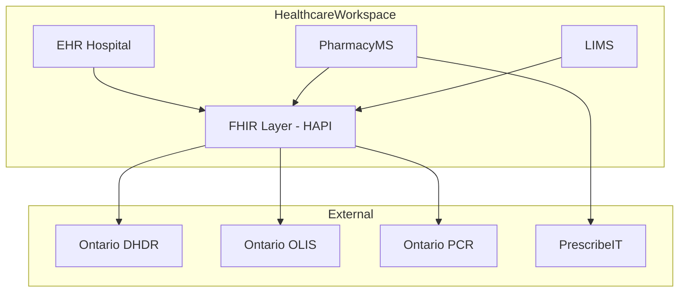

# Architecture Template

> **Instructions:** Copy into `{initiative}/solutioning/architecture.md`. Use `bmad-create-architecture` with Winston (Architect) to complete. Alex (FHIR SME) reviews all FHIR sections.

---

## 1. Document metadata

| Field | Value |
|---|---|
| Initiative | |
| PRD reference | `{initiative}/definition/prd.md` |
| Author | Winston (Architect) |
| Reviewers | Alex (FHIR), Amelia (Backend), Jordan (Frontend) |
| Status | Draft / In Review / Approved |
| Created | YYYY-MM-DD |

## 2. Architecture overview

### 2.1 Context diagram

<!-- Mermaid C4 context diagram showing the system boundary, external actors, and external systems -->

### 2.2 Scope and assumptions

<!-- Explicitly state what is and is not in architectural scope -->

### 2.3 Architectural drivers

| Driver | Type | Priority | Source |
|---|---|---|---|
| | Performance / Security / Scalability / Compliance / Interoperability | | PRD / Regulation / Business |

## 3. System architecture

### 3.1 Component diagram

<!-- Mermaid component diagram: microservices, microfrontends, FHIR server, databases, caches -->

### 3.2 Microservice boundaries

| Service | Language | Domain | Database | Key dependencies |
|---|---|---|---|---|
| | Go / Rust | | PostgreSQL / MongoDB / Redis | |

### 3.3 Microfrontend boundaries

| MFE | Domain | FHIR resources | Shared dependencies |
|---|---|---|---|
| | | | shared-ui, design tokens |

### 3.4 Data architecture

#### Relational (PostgreSQL + PgBouncer)

| Schema | Service | Key tables | Migration tool |
|---|---|---|---|
| | | | Goose |

#### NoSQL

| Collection/table | Service | Document shape | Use case |
|---|---|---|---|

#### Cache (Redis)

| Key pattern | Service | TTL | Use case |
|---|---|---|---|

### 3.5 FHIR architecture

> **Requires Alex (FHIR SME) review and sign-off.**

| Concern | Decision |
|---|---|
| FHIR version | R4 |
| HAPI FHIR server style | JPA / Plain / Hybrid |
| Profile source | IG NPM package(s) |
| Validation strategy | |
| Terminology server | |
| Search parameters | |
| Subscriptions | |
| Multi-tenancy | |

### 3.6 Workflow architecture (Temporal)

| Workflow | Trigger | Activities | Saga/compensation | Timeout |
|---|---|---|---|---|

### 3.7 Integration architecture

| Integration | Protocol | Direction | Auth | FHIR IG | Error handling |
|---|---|---|---|---|---|

## 4. API design

### 4.1 API contracts

| Endpoint | Method | Service | Request | Response | Auth scope | Rate limit |
|---|---|---|---|---|---|---|

### 4.2 FHIR API contracts

> **Uses Alex's API contract format.**

| Capability | Endpoint | Method | Profile(s) | Search params | Auth scope | Validation |
|---|---|---|---|---|---|---|

## 5. Security architecture

| Concern | Decision | Standard |
|---|---|---|
| Authentication | SMART on FHIR / OAuth 2.0 | |
| Authorization | RBAC / ABAC / scope-based | |
| PHI encryption at rest | AES-256 | PIPEDA/PHIPA/HIPAA |
| PHI encryption in transit | TLS 1.3 | |
| Audit logging | | |
| Consent management | | |
| Data residency | Canada | |
| Secret management | | |

## 6. Deployment architecture

| Concern | Decision |
|---|---|
| Container orchestration | Kubernetes |
| CI/CD | GitHub Actions |
| Deployment strategy | Blue-green / Canary |
| Environment promotion | Dev → Staging → Production |
| Database migration | Goose |
| Rollback strategy | |
| Monitoring | |
| Alerting | |

## 7. Cross-cutting concerns

| Concern | Approach |
|---|---|
| Logging | Structured JSON, correlation IDs |
| Tracing | OpenTelemetry |
| Metrics | Prometheus / Grafana |
| Feature flags | |
| Configuration | |
| Health checks | |

## 8. Feasibility assessment

| Dimension | Assessment | Risk | Mitigation |
|---|---|---|---|
| Technical complexity | Low / Medium / High | | |
| Team capacity | | | |
| Timeline | | | |
| Dependencies | | | |
| Regulatory | | | |

## 9. ADR references

| ADR ID | Title | Status | File |
|---|---|---|---|
| ADR-001 | | Proposed / Accepted | `adrs/ADR-001.md` |

## 10. Sign-off

| Role | Agent | Sign-off | Date |
|---|---|---|---|
| Architect | Winston | [ ] | |
| FHIR SME | Alex | [ ] | |
| Backend Dev | Amelia | [ ] | |
| Frontend Dev | Jordan | [ ] | |
| PM | John | [ ] | |
