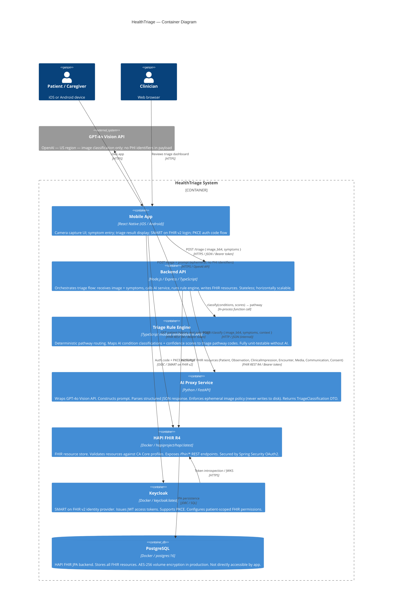

# C4 Container — HealthTriage

```mermaid
C4Container
  title HealthTriage — Container Diagram

  Person(patient, "Patient / Caregiver", "iOS or Android device")
  Person(clinician, "Clinician", "Web browser")

  Container_Boundary(app_boundary, "HealthTriage System") {

    Container(mobile, "Mobile App", "React Native (iOS / Android)", "Camera capture UI; symptom entry; triage result display; SMART on FHIR v2 login; PKCE auth code flow")

    Container(api, "Backend API", "Node.js / Express / TypeScript", "Orchestrates triage flow: receives image + symptoms, calls AI service, runs rule engine, writes FHIR resources. Stateless; horizontally scalable.")

    Container(rule_engine, "Triage Rule Engine", "TypeScript module (embedded in API)", "Deterministic pathway routing. Maps AI condition classifications + confidence scores to triage pathway codes. Fully unit-testable without AI.")

    Container(ai_proxy, "AI Proxy Service", "Python / FastAPI", "Wraps GPT-4o Vision API. Constructs prompt. Parses structured JSON response. Enforces ephemeral image policy (never writes to disk). Returns TriageClassification DTO.")

    Container(fhir_server, "HAPI FHIR R4", "Docker / hapiproject/hapi:latest", "FHIR resource store. Validates resources against CA Core profiles. Exposes /fhir/* REST endpoints. Secured by Spring Security OAuth2.")

    Container(idp, "Keycloak", "Docker / keycloak:latest", "SMART on FHIR v2 identity provider. Issues JWT access tokens. Supports PKCE. Configures patient-scoped FHIR permissions.")

    ContainerDb(pg, "PostgreSQL", "Docker / postgres:16", "HAPI FHIR JPA backend. Stores all FHIR resources. AES-256 volume encryption in production. Not directly accessible by app.")
  }

  Rel(patient, mobile, "Uses app", "HTTPS")
  Rel(clinician, mobile, "Reviews triage dashboard", "HTTPS")
  Rel(mobile, idp, "Auth code + PKCE exchange", "OIDC / SMART on FHIR v2")
  Rel(mobile, api, "POST /triage { image_b64, symptoms }", "HTTPS / JSON / Bearer token")
  Rel(mobile, fhir_server, "GET patient history and past triage", "FHIR REST R4 / Bearer token")
  Rel(api, ai_proxy, "POST /classify { image_b64, symptoms, context }", "HTTP / JSON (internal)")
  Rel(api, rule_engine, "classify(conditions, scores) → pathway", "In-process function call")
  Rel(api, fhir_server, "POST/PUT FHIR resources (Patient, Observation, ClinicalImpression, Encounter, Media, Communication, Consent)", "FHIR REST R4 / Bearer token")
  Rel(ai_proxy, ai_external, "POST image + prompt (ephemeral; no PHI identifiers)", "HTTPS / OpenAI API")
  Rel(fhir_server, pg, "JPA persistence", "JDBC / SQL")
  Rel(idp, fhir_server, "Token introspection / JWKS", "HTTPS")

  System_Ext(ai_external, "GPT-4o Vision API", "OpenAI — US region — image classification only; no PHI identifiers in payload")
```
