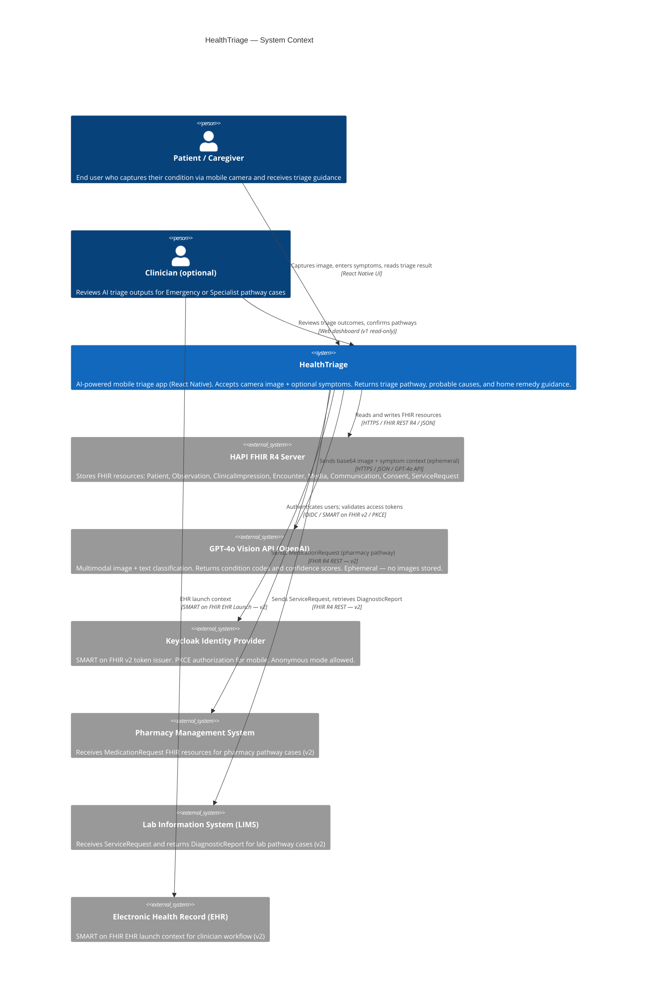

# C4 Context — HealthTriage

```mermaid
C4Context
  title HealthTriage — System Context

  Person(patient, "Patient / Caregiver", "End user who captures their condition via mobile camera and receives triage guidance")
  Person(clinician, "Clinician (optional)", "Reviews AI triage outputs for Emergency or Specialist pathway cases")

  System(app, "HealthTriage", "AI-powered mobile triage app (React Native). Accepts camera image + optional symptoms. Returns triage pathway, probable causes, and home remedy guidance.")

  System_Ext(hapi, "HAPI FHIR R4 Server", "Stores FHIR resources: Patient, Observation, ClinicalImpression, Encounter, Media, Communication, Consent, ServiceRequest")
  System_Ext(ai, "GPT-4o Vision API (OpenAI)", "Multimodal image + text classification. Returns condition codes and confidence scores. Ephemeral — no images stored.")
  System_Ext(idp, "Keycloak Identity Provider", "SMART on FHIR v2 token issuer. PKCE authorization for mobile. Anonymous mode allowed.")
  System_Ext(pharmacy, "Pharmacy Management System", "Receives MedicationRequest FHIR resources for pharmacy pathway cases (v2)")
  System_Ext(lims, "Lab Information System (LIMS)", "Receives ServiceRequest and returns DiagnosticReport for lab pathway cases (v2)")
  System_Ext(ehr, "Electronic Health Record (EHR)", "SMART on FHIR EHR launch context for clinician workflow (v2)")

  Rel(patient, app, "Captures image, enters symptoms, reads triage result", "React Native UI")
  Rel(clinician, app, "Reviews triage outcomes, confirms pathways", "Web dashboard (v1 read-only)")
  Rel(app, hapi, "Reads and writes FHIR resources", "HTTPS / FHIR REST R4 / JSON")
  Rel(app, ai, "Sends base64 image + symptom context (ephemeral)", "HTTPS / JSON / GPT-4o API")
  Rel(app, idp, "Authenticates users; validates access tokens", "OIDC / SMART on FHIR v2 / PKCE")
  Rel(app, pharmacy, "Sends MedicationRequest (pharmacy pathway)", "FHIR R4 REST — v2")
  Rel(app, lims, "Sends ServiceRequest, retrieves DiagnosticReport", "FHIR R4 REST — v2")
  Rel(clinician, ehr, "EHR launch context", "SMART on FHIR EHR Launch — v2")
```
