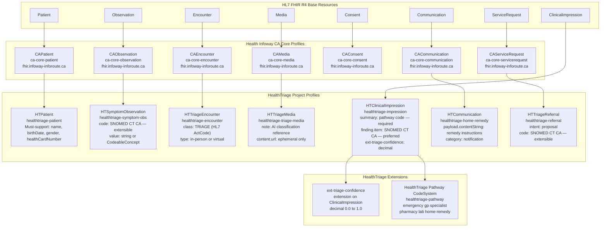

# FHIR Profile Tree — HealthTriage

```mermaid
graph TD
  subgraph "HL7 FHIR R4 Base Resources"
    BasePatient[Patient]
    BaseObservation[Observation]
    BaseEncounter[Encounter]
    BaseMedia[Media]
    BaseClinicalImpression[ClinicalImpression]
    BaseCommunication[Communication]
    BaseServiceRequest[ServiceRequest]
    BaseConsent[Consent]
  end

  subgraph "Health Infoway CA Core Profiles"
    CAPatient["CAPatient\nca-core-patient\nfhir.infoway-inforoute.ca"]
    CAObservation["CAObservation\nca-core-observation\nfhir.infoway-inforoute.ca"]
    CAEncounter["CAEncounter\nca-core-encounter\nfhir.infoway-inforoute.ca"]
    CAMedia["CAMedia\nca-core-media\nfhir.infoway-inforoute.ca"]
    CAConsent["CAConsent\nca-core-consent\nfhir.infoway-inforoute.ca"]
    CAServiceRequest["CAServiceRequest\nca-core-servicerequest\nfhir.infoway-inforoute.ca"]
    CACommunication["CACommunication\nca-core-communication\nfhir.infoway-inforoute.ca"]
  end

  subgraph "HealthTriage Project Profiles"
    HTPatient["HTPatient\nhealthtriage-patient\nMust-support: name, birthDate, gender, healthCardNumber"]
    HTSymptomObs["HTSymptomObservation\nhealthtriage-symptom-obs\ncode: SNOMED CT CA — extensible\nvalue: string or CodeableConcept"]
    HTEncounter["HTTriageEncounter\nhealthtriage-encounter\nclass: TRIAGE (HL7 ActCode)\ntype: in-person or virtual"]
    HTMedia["HTTriageMedia\nhealthtriage-triage-media\nnote: AI classification reference\ncontent.url: ephemeral only"]
    HTImpression["HTClinicalImpression\nhealthtriage-impression\nsummary: pathway code — required\nfinding.item: SNOMED CT CA — preferred\next-triage-confidence: decimal"]
    HTCommunication["HTCommunication\nhealthtriage-home-remedy\npayload.contentString: remedy instructions\ncategory: notification"]
    HTServiceRequest["HTTriageReferral\nhealthtriage-referral\nintent: proposal\ncode: SNOMED CT CA — extensible"]
  end

  subgraph "HealthTriage Extensions"
    ExtConfidence["ext-triage-confidence\nextension on ClinicalImpression\ndecimal 0.0 to 1.0"]
    ExtPathway["HealthTriage Pathway CodeSystem\nhealthtriage-pathway\nemergency gp specialist\npharmacy lab home-remedy"]
  end

  BasePatient --> CAPatient --> HTPatient
  BaseObservation --> CAObservation --> HTSymptomObs
  BaseEncounter --> CAEncounter --> HTEncounter
  BaseMedia --> CAMedia --> HTMedia
  BaseClinicalImpression --> HTImpression
  BaseCommunication --> CACommunication --> HTCommunication
  BaseServiceRequest --> CAServiceRequest --> HTServiceRequest
  BaseConsent --> CAConsent

  HTImpression --> ExtConfidence
  HTImpression --> ExtPathway
```
