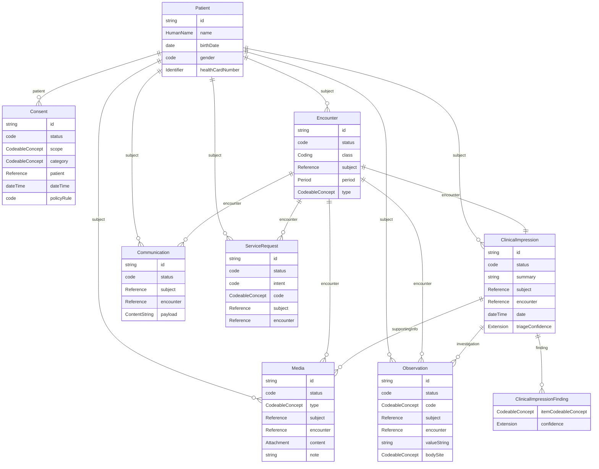

# FHIR Resource Map — HealthTriage

```mermaid
erDiagram
  Patient {
    string id
    HumanName name
    date birthDate
    code gender
    Identifier healthCardNumber
  }

  Consent {
    string id
    code status
    CodeableConcept scope
    CodeableConcept category
    Reference patient
    dateTime dateTime
    code policyRule
  }

  Encounter {
    string id
    code status
    Coding class
    Reference subject
    Period period
    CodeableConcept type
  }

  Media {
    string id
    code status
    CodeableConcept type
    Reference subject
    Reference encounter
    Attachment content
    string note
  }

  Observation {
    string id
    code status
    CodeableConcept code
    Reference subject
    Reference encounter
    string valueString
    CodeableConcept bodySite
  }

  ClinicalImpression {
    string id
    code status
    string summary
    Reference subject
    Reference encounter
    dateTime date
    Extension triageConfidence
  }

  ClinicalImpressionFinding {
    CodeableConcept itemCodeableConcept
    Extension confidence
  }

  Communication {
    string id
    code status
    Reference subject
    Reference encounter
    ContentString payload
  }

  ServiceRequest {
    string id
    code status
    code intent
    CodeableConcept code
    Reference subject
    Reference encounter
  }

  Patient ||--o{ Consent : "patient"
  Patient ||--o{ Encounter : "subject"
  Patient ||--o{ Media : "subject"
  Patient ||--o{ Observation : "subject"
  Patient ||--o{ ClinicalImpression : "subject"
  Patient ||--o{ Communication : "subject"
  Patient ||--o{ ServiceRequest : "subject"

  Encounter ||--o{ Media : "encounter"
  Encounter ||--o{ Observation : "encounter"
  Encounter ||--|| ClinicalImpression : "encounter"
  Encounter ||--o{ Communication : "encounter"
  Encounter ||--o{ ServiceRequest : "encounter"

  ClinicalImpression ||--o{ ClinicalImpressionFinding : "finding"
  ClinicalImpression ||--o{ Observation : "investigation"
  ClinicalImpression ||--o{ Media : "supportingInfo"
```
