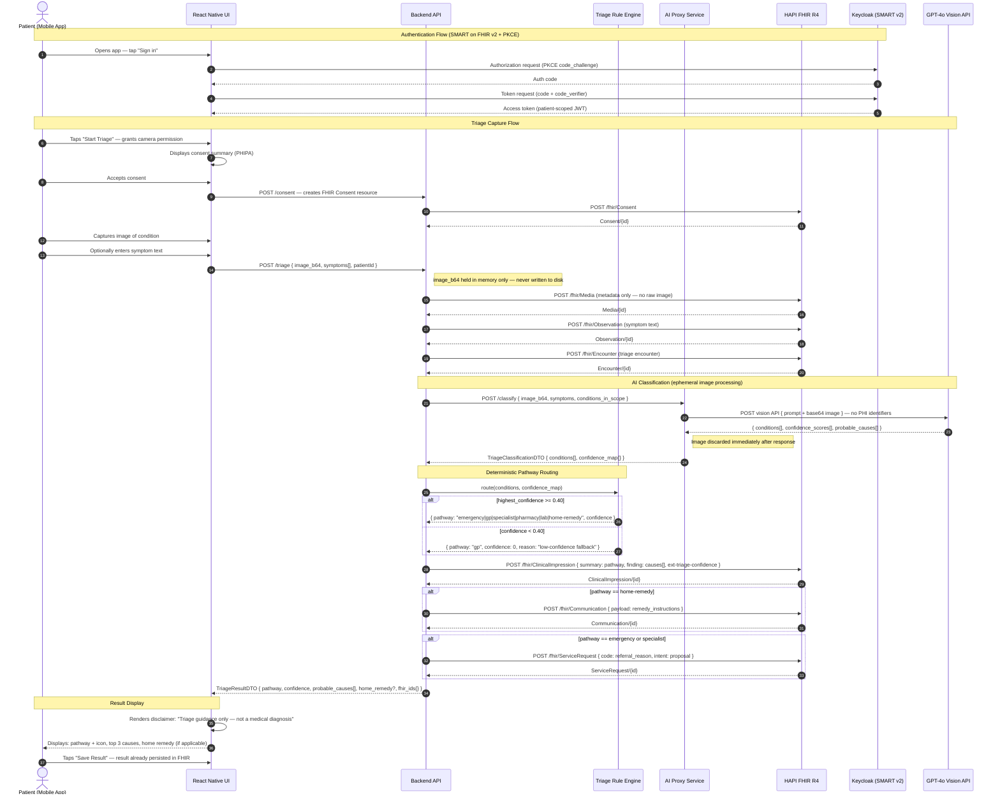

# Patient Data Flow — HealthTriage

```mermaid
sequenceDiagram
  autonumber
  actor P as Patient (Mobile App)
  participant UI as React Native UI
  participant API as Backend API
  participant RE as Triage Rule Engine
  participant AIProxy as AI Proxy Service
  participant FHIR as HAPI FHIR R4
  participant IDP as Keycloak (SMART v2)
  participant GPT as GPT-4o Vision API

  Note over P, IDP: Authentication Flow (SMART on FHIR v2 + PKCE)
  P->>UI: Opens app — tap "Sign in"
  UI->>IDP: Authorization request (PKCE code_challenge)
  IDP-->>UI: Auth code
  UI->>IDP: Token request (code + code_verifier)
  IDP-->>UI: Access token (patient-scoped JWT)

  Note over P, GPT: Triage Capture Flow
  P->>UI: Taps "Start Triage" — grants camera permission
  UI->>UI: Displays consent summary (PHIPA)
  P->>UI: Accepts consent
  UI->>API: POST /consent — creates FHIR Consent resource
  API->>FHIR: POST /fhir/Consent
  FHIR-->>API: Consent/{id}

  P->>UI: Captures image of condition
  P->>UI: Optionally enters symptom text
  UI->>API: POST /triage { image_b64, symptoms[], patientId }
  Note right of API: image_b64 held in memory only — never written to disk

  API->>FHIR: POST /fhir/Media (metadata only — no raw image)
  FHIR-->>API: Media/{id}
  API->>FHIR: POST /fhir/Observation (symptom text)
  FHIR-->>API: Observation/{id}
  API->>FHIR: POST /fhir/Encounter (triage encounter)
  FHIR-->>API: Encounter/{id}

  Note over API, GPT: AI Classification (ephemeral image processing)
  API->>AIProxy: POST /classify { image_b64, symptoms, conditions_in_scope }
  AIProxy->>GPT: POST vision API { prompt + base64 image } — no PHI identifiers
  GPT-->>AIProxy: { conditions[], confidence_scores[], probable_causes[] }
  Note right of AIProxy: Image discarded immediately after response

  AIProxy-->>API: TriageClassificationDTO { conditions[], confidence_map{} }

  Note over API, RE: Deterministic Pathway Routing
  API->>RE: route(conditions, confidence_map)
  alt highest_confidence >= 0.40
    RE-->>API: { pathway: "emergency|gp|specialist|pharmacy|lab|home-remedy", confidence }
  else confidence < 0.40
    RE-->>API: { pathway: "gp", confidence: 0, reason: "low-confidence fallback" }
  end

  API->>FHIR: POST /fhir/ClinicalImpression { summary: pathway, finding: causes[], ext-triage-confidence }
  FHIR-->>API: ClinicalImpression/{id}

  alt pathway == home-remedy
    API->>FHIR: POST /fhir/Communication { payload: remedy_instructions }
    FHIR-->>API: Communication/{id}
  end

  alt pathway == emergency or specialist
    API->>FHIR: POST /fhir/ServiceRequest { code: referral_reason, intent: proposal }
    FHIR-->>API: ServiceRequest/{id}
  end

  API-->>UI: TriageResultDTO { pathway, confidence, probable_causes[], home_remedy?, fhir_ids{} }

  Note over UI, P: Result Display
  UI->>UI: Renders disclaimer: "Triage guidance only — not a medical diagnosis"
  UI-->>P: Displays: pathway + icon, top 3 causes, home remedy (if applicable)
  P->>UI: Taps "Save Result" — result already persisted in FHIR
```
