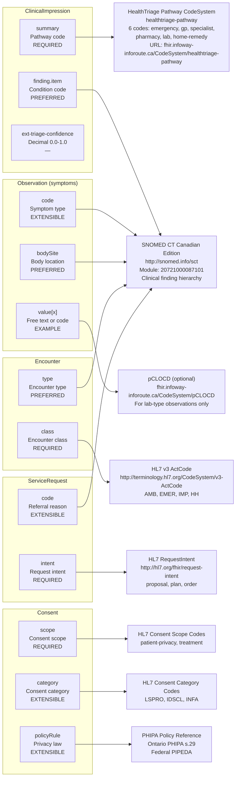

# Terminology Binding Map — HealthTriage

```mermaid
graph LR
  subgraph "ClinicalImpression"
    ci_summary["summary\nPathway code\n REQUIRED"]
    ci_finding["finding.item\nCondition code\nPREFERRED"]
    ci_confidence["ext-triage-confidence\nDecimal 0.0-1.0\n—"]
  end

  subgraph "Observation (symptoms)"
    obs_code["code\nSymptom type\nEXTENSIBLE"]
    obs_body["bodySite\nBody location\nPREFERRED"]
    obs_value["value[x]\nFree text or code\nEXAMPLE"]
  end

  subgraph "Encounter"
    enc_class["class\nEncounter class\nREQUIRED"]
    enc_type["type\nEncounter type\nPREFERRED"]
  end

  subgraph "ServiceRequest"
    sr_code["code\nReferral reason\nEXTENSIBLE"]
    sr_intent["intent\nRequest intent\nREQUIRED"]
  end

  subgraph "Consent"
    con_scope["scope\nConsent scope\nREQUIRED"]
    con_cat["category\nConsent category\nEXTENSIBLE"]
    con_policy["policyRule\nPrivacy law\nEXTENSIBLE"]
  end

  ci_summary --> HTPathway["HealthTriage Pathway CodeSystem\nhealthtriage-pathway\n6 codes: emergency, gp, specialist,\npharmacy, lab, home-remedy\nURL: fhir.infoway-inforoute.ca/CodeSystem/healthtriage-pathway"]

  ci_finding --> SNOMED_CA["SNOMED CT Canadian Edition\nhttp://snomed.info/sct\nModule: 20721000087101\nClinical finding hierarchy"]

  obs_code --> SNOMED_CA
  obs_body --> SNOMED_CA

  enc_class --> HL7ActCode["HL7 v3 ActCode\nhttp://terminology.hl7.org/CodeSystem/v3-ActCode\nAMB, EMER, IMP, HH"]

  enc_type --> SNOMED_CA

  sr_code --> SNOMED_CA
  sr_intent --> HL7RequestIntent["HL7 RequestIntent\nhttp://hl7.org/fhir/request-intent\nproposal, plan, order"]

  con_scope --> HL7ConsentScope["HL7 Consent Scope Codes\npatient-privacy, treatment"]
  con_cat --> HL7ConsentCat["HL7 Consent Category Codes\nLSPRO, IDSCL, INFA"]
  con_policy --> PHIPARef["PHIPA Policy Reference\nOntario PHIPA s.29\nFederal PIPEDA"]

  obs_value --> pCLOCD["pCLOCD (optional)\nfhir.infoway-inforoute.ca/CodeSystem/pCLOCD\nFor lab-type observations only"]
```
