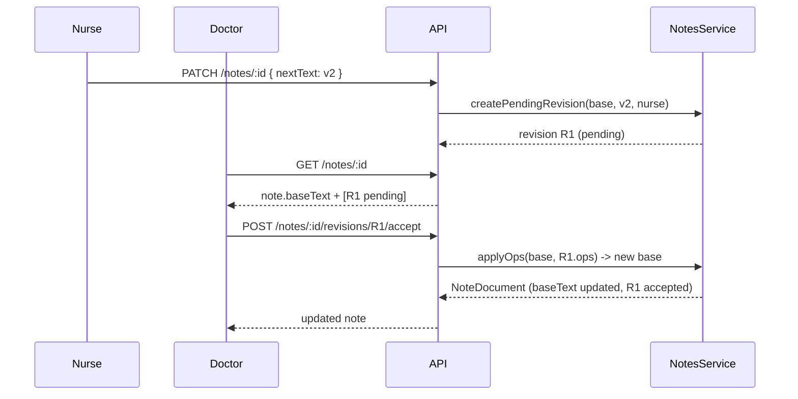

# Notes Feature — Low-Level Design (LLD)

| Field | Value |
|---|---|
| Companion doc | [hld.md](hld.md) |
| Author | Winston (Architect) / Amelia (Dev) |
| Status | Draft — backs the Phase 1 implementation |

## 1. Domain module layout

```
ehr/src/notes/
  types.ts          # NoteDocument, NoteRevision, ChangeOp, NoteComment, NoteTemplate, permission types
  diffEngine.ts      # word-level diff (LCS-based) + patch application + op-merge helpers
  permissions.ts     # role → capability matrix + guard functions
  service.mock.ts    # in-memory NotesService implementation (server-side singleton)
  templates.ts       # starter note templates (Progress, Nursing, Medication Review, Administrative)
```

## 2. Data model

### 2.1 TypeScript domain types (`types.ts`)

```ts
export type NoteType =
  | "progress" | "soap" | "nursing" | "medication-review"
  | "lab-annotation" | "administrative" | "consult";

export type NoteStatus = "draft" | "signed";
export type RevisionStatus = "pending" | "accepted" | "rejected" | "superseded";

export interface ChangeOp {
  id: string;
  kind: "insert" | "delete" | "retain";
  text: string;       // text inserted/deleted, empty for retain
  position: number;    // offset into the base text this op applies from
}

export interface NoteRevision {
  id: string;
  noteId: string;
  authorId: string;
  authorName: string;
  authorRole: Role;
  createdAt: string;
  status: RevisionStatus;
  baseRevisionId: string | null; // revision this diff was computed against
  ops: ChangeOp[];
  resultingText?: string;        // populated once accepted (merged snapshot)
  reviewedBy?: string;
  reviewedAt?: string;
}

export interface NoteComment {
  id: string; noteId: string; authorId: string; authorName: string;
  createdAt: string; body: string; anchorOpId?: string;
}

export interface NoteDocument {
  id: string;
  patientId: string;
  encounterId?: string;
  type: NoteType;
  title: string;
  status: NoteStatus;
  createdBy: { id: string; name: string; role: Role };
  createdAt: string;
  updatedAt: string;
  signedBy?: { id: string; name: string; role: Role };
  signedAt?: string;
  baseText: string;           // last clean/accepted snapshot
  currentRevisionId: string;  // pointer to head revision (accepted or pending)
  pendingRevisions: NoteRevision[]; // unmerged, attributable pending edits
  addenda: { id: string; authorId: string; authorName: string; createdAt: string; text: string }[];
  tags: string[];
}
```

### 2.2 Prisma persistence model (Phase 2 — schema added now, additive)

```prisma
model ClinicalNote {
  id             String   @id @default(cuid())
  patientId      String
  encounterId    String?
  type           String   // NoteType
  title          String
  status         String   // draft | signed
  baseText       String   @db.Text
  createdById    String
  createdAt      DateTime @default(now())
  updatedAt      DateTime @updatedAt
  signedById     String?
  signedAt       DateTime?
  tags           String[]

  patient        Patient       @relation(fields: [patientId], references: [id])
  encounter      Encounter?    @relation(fields: [encounterId], references: [id])
  revisions      NoteRevision[]
  comments       NoteComment[]
  addenda        NoteAddendum[]

  @@index([patientId])
  @@index([encounterId])
  @@index([status])
  @@map("clinical_notes")
}

model NoteRevision {
  id              String   @id @default(cuid())
  noteId          String
  authorId        String
  createdAt       DateTime @default(now())
  status          String   // pending | accepted | rejected | superseded
  baseRevisionId  String?
  ops             Json     // ChangeOp[]
  resultingText   String?  @db.Text
  reviewedById    String?
  reviewedAt      DateTime?

  note ClinicalNote @relation(fields: [noteId], references: [id])

  @@index([noteId])
  @@index([status])
  @@map("note_revisions")
}

model NoteComment {
  id         String   @id @default(cuid())
  noteId     String
  authorId   String
  body       String   @db.Text
  anchorOpId String?
  createdAt  DateTime @default(now())

  note ClinicalNote @relation(fields: [noteId], references: [id])

  @@index([noteId])
  @@map("note_comments")
}

model NoteAddendum {
  id        String   @id @default(cuid())
  noteId    String
  authorId  String
  text      String   @db.Text
  createdAt DateTime @default(now())

  note ClinicalNote @relation(fields: [noteId], references: [id])

  @@index([noteId])
  @@map("note_addenda")
}
```

> Not yet migrated (no live DB in this environment). `service.mock.ts`
> mirrors this exact shape so swapping to a Prisma repository later is a
> drop-in replacement behind the `NotesService` interface.

## 3. Track-changes diff engine (`diffEngine.ts`)

- `diffWords(base: string, next: string): ChangeOp[]` — token-level (word +
  whitespace boundaries) LCS diff, returns a minimal insert/delete/retain op
  list. Word-level (not char-level) keeps op counts small and human-readable
  in the UI, and (not line-level) keeps it usable for prose paragraphs.
- `applyOps(base: string, ops: ChangeOp[]): string` — deterministic patch
  application, used when a revision is accepted.
- `renderTrackChanges(base: string, revisions: NoteRevision[]): RenderSegment[]`
  — merges the base with **all pending** revisions' ops into a single ordered
  list of `{ text, kind: "unchanged"|"insert"|"delete", revisionId, authorName }`
  segments for the editor to render inline (insert = underline, delete =
  strikethrough, colored per author via a stable hash-to-palette function).

Complexity: $O(n \cdot m)$ LCS over word tokens where $n, m$ are token
counts of base/next — acceptable for clinical note lengths (typically <2000
words); no external diff dependency required.

## 4. Permission matrix (`permissions.ts`)

```ts
export const NOTE_TYPE_ALLOWLIST: Record<Role, NoteType[] | "all"> = {
  DOCTOR: "all",
  NURSE: ["progress", "nursing", "soap", "consult"],
  PHARMACIST: ["medication-review"],
  LAB_TECH: ["lab-annotation"],
  ADMIN: "all",
  RECEPTIONIST: ["administrative"],
  BILLING: ["administrative"],
  PCA: ["administrative"],
  PATIENT: [],
  PENDING: [],
};

export function canAuthor(role: Role, type: NoteType): boolean;
export function canSign(role: Role, type: NoteType): boolean;   // clinical roles only, own-type
export function canReviewChanges(role: Role, note: NoteDocument): boolean; // author roles w/ edit rights
export function canView(role: Role, note: NoteDocument): boolean; // all staff = true; admin notes hidden from patients
```

Server routes call these guards before mutating; the client hook
`useNotesPermissions(role)` wraps the same functions purely for UI
affordance (disabling buttons, hiding actions).

## 5. API contract (`ehr/src/app/api/notes/**`)

| Method | Route | Body | Response | Notes |
|---|---|---|---|---|
| GET | `/api/notes?patientId=&status=&type=` | — | `NoteDocument[]` (summaries) | list/filter |
| POST | `/api/notes` | `{ patientId, encounterId?, type, title, baseText }` | `NoteDocument` | create; author = session user |
| GET | `/api/notes/:noteId` | — | `NoteDocument` (full, incl. pending revisions) | |
| PATCH | `/api/notes/:noteId` | `{ nextText }` | `{ revision: NoteRevision }` | diffs against `baseText`, stores as **pending** revision (never overwrites directly) |
| POST | `/api/notes/:noteId/revisions/:revisionId/accept` | `{ opIds?: string[] }` | `NoteDocument` | full accept if `opIds` omitted; merges into new base |
| POST | `/api/notes/:noteId/revisions/:revisionId/reject` | `{ opIds?: string[] }` | `NoteDocument` | marks rejected, discarded from base |
| POST | `/api/notes/:noteId/sign` | — | `NoteDocument` | requires `canSign`; requires zero pending revisions |
| POST | `/api/notes/:noteId/addendum` | `{ text }` | `NoteDocument` | only allowed when `status === "signed"` |
| POST | `/api/notes/:noteId/comments` | `{ body, anchorOpId? }` | `NoteComment` | |

All mutating routes: permission guard → service call → `withAudit(...)` →
`Provenance`-shaped log entry → JSON response. 403 on permission failure,
409 if signing with pending revisions, 404 if note/revision missing.

## 6. Sequence: concurrent edit + review



## 7. Component tree (`ehr/src/components/notes/**`)

```
NotesWorkbench.tsx         -- list + filters (patient/type/status), role-aware "New Note" menu
  NoteListItem.tsx          -- summary row (title, author, status, pending-count badge)
  NewNoteDialog.tsx         -- patient/type/title picker, template insertion
NoteEditor.tsx              -- orchestrates authoring + track-changes review for one note
  TiptapEditor.tsx          -- Tiptap (ProseMirror, MIT) rich-text authoring surface;
                                reports plain text via onChangeText for the diff engine
  TrackChangesToolbar.tsx   -- Accept All / Reject All / Sign / Add Addendum
  TrackChangesOverlay.tsx   -- renders RenderSegment[] with insert/delete styling per author
  RevisionHistoryPanel.tsx  -- timeline of accepted/rejected revisions (audit view)
  NoteCommentThread.tsx     -- inline comments anchored to a change
useNotesPermissions.ts      -- client hook wrapping permissions.ts against session role
```

State: `NoteEditor` holds local draft text + debounced (600ms) PATCH; on
response it merges the returned pending revision into local state
optimistically (no refetch needed). `TiptapEditor` is uncontrolled after
mount (initial content only, via `key={note.id}` remount on note switch) and
exposes an imperative `insertText()` handle so template insertion
(`NoteEditor.insertTemplate`) can append content without fighting Tiptap's
internal document state. `TrackChangesOverlay` is pure/derived from
`renderTrackChanges(note.baseText, note.pendingRevisions)`.

## 8. Error handling

- Network failure on autosave → local draft retained, non-blocking toast
  "Changes saved locally — retrying…", exponential backoff retry.
- Accept/reject on a revision already superseded (race) → 409, client
  refetches note and re-renders current pending state.
- Sign attempt with pending revisions → 409 with `{ pendingCount }`; UI
  surfaces "Resolve N pending changes before signing."

## 10. Editor engine: Tiptap

`ehr/src/components/notes/TiptapEditor.tsx` wraps `@tiptap/react` +
`@tiptap/starter-kit` + `@tiptap/extension-placeholder` +
`@tiptap/extension-underline` + `@tiptap/extension-link` (all MIT,
ProseMirror-based, already present in `ehr/package.json`):

- **Toolbar**: bold, italic, underline, strike, H2/H3, bullet/ordered list,
  blockquote, undo/redo — implemented as plain Tailwind buttons calling
  Tiptap chain commands (`editor.chain().focus().toggleBold().run()`), no
  icon library dependency added.
- **Content boundary**: the editor is intentionally the *only* place rich
  formatting exists. `onUpdate` reports `editor.getText({ blockSeparator:
  "\n\n" })` — plain text — to `NoteEditor`, which feeds it into the
  existing `diffWords`/`applyOps` track-changes engine unchanged. This
  keeps §3's diff engine simple (word-level LCS over plain text) rather
  than requiring HTML- or ProseMirror-JSON-aware diffing.
- **Lifecycle**: `TiptapEditor` is uncontrolled after mount — `initialText`
  seeds the document once; `NotesWorkbench` remounts `NoteEditor` (and
  therefore `TiptapEditor`) via `key={note.id}` when the selected note
  changes, so there is no effect-based content-sync (avoids
  `react-hooks/set-state-in-effect` and keeps cursor/undo-stack behavior
  correct). Template insertion uses an imperative handle
  (`TiptapEditorHandle.insertText`) rather than prop-driven content.
- **Known Phase 1 limitation**: because tracked content is plain text,
  formatting (bold/lists/etc.) is not preserved through the accept/reject
  cycle of a *pending* revision — the merged base text is plain. If rich
  formatting must survive tracked changes, the recommended upgrade is
  ProseMirror's own `prosemirror-changeset` (MIT, already resolvable from
  the npm registry) operating on the editor's document steps instead of
  string diffing; this is a Phase 2+ enhancement, not required for the
  current rollout.

## 11. Testing plan (Phase 1)

- Unit: `diffEngine` (insert/delete/retain correctness, round-trip
  `applyOps(base, diffWords(base, next)) === next`).
- Unit: `permissions` matrix for every role × note type combination.
- Integration: API route happy-path + 403/409 cases via route handler tests.
- Manual smoke: create note as NURSE, edit as DOCTOR (pending revision
  appears), accept, sign, attempt edit (blocked, addendum works).
