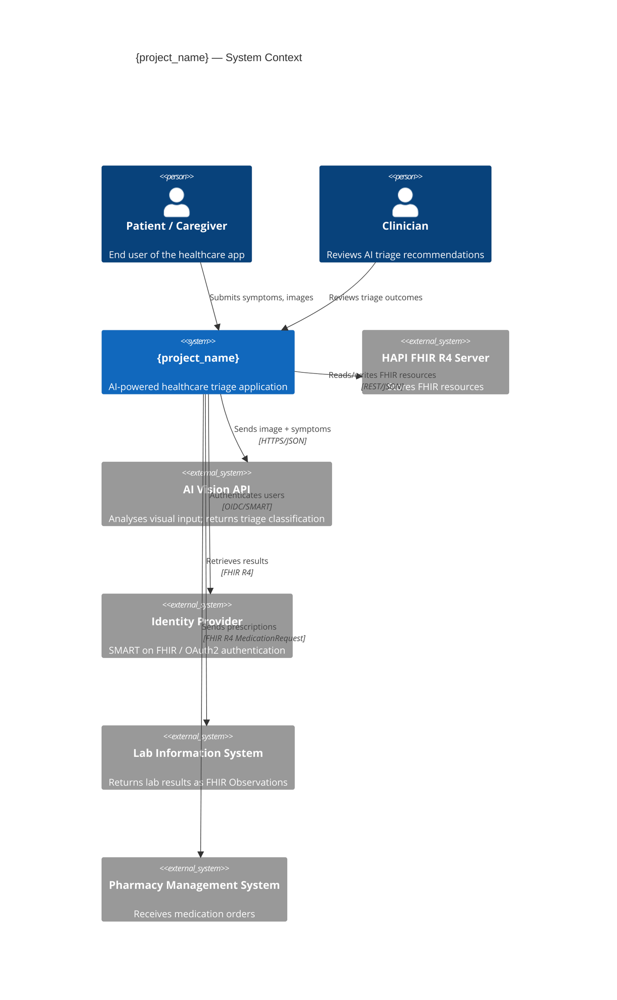
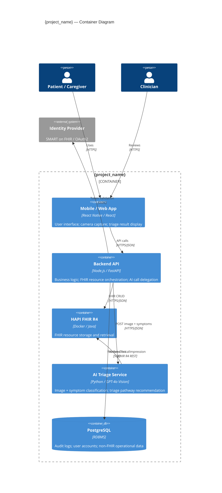
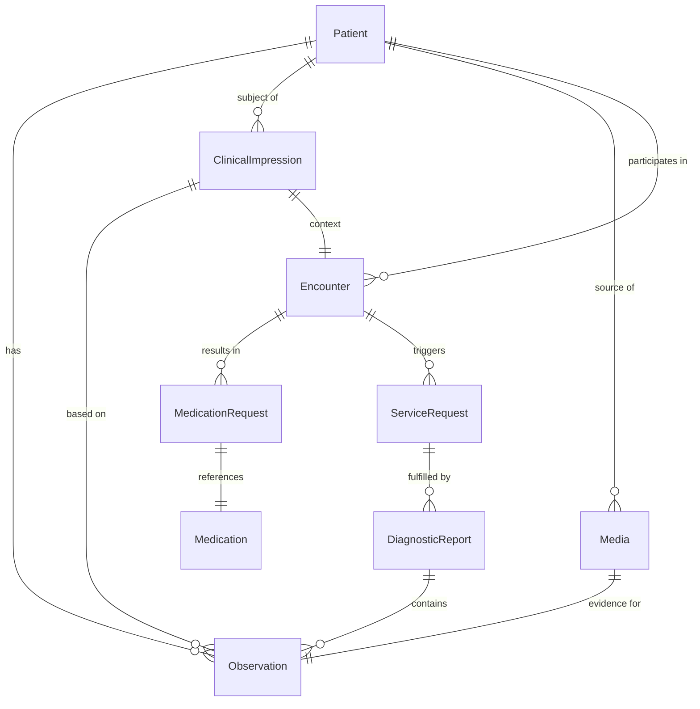
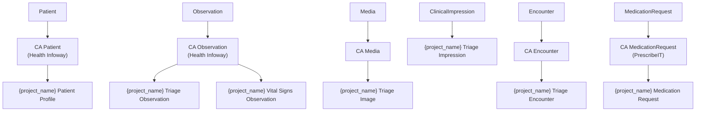
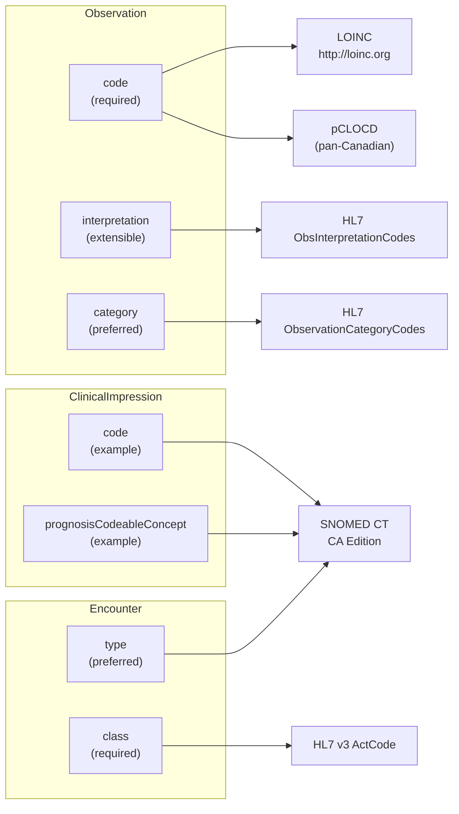
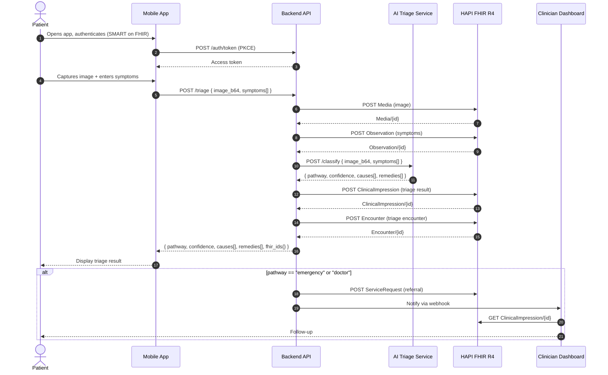

# hdl-diagrams

Generate and refresh architecture diagrams for the active healthcare project.

---

## Capabilities

| User says | Capability |
|---|---|
| "generate diagrams", "create architecture diagrams", "generate all diagrams" | [Generate All Diagrams](#generate-all-diagrams) |
| "regenerate [diagram name]", "update [diagram name] diagram" | [Regenerate One Diagram](#regenerate-one-diagram) |
| "generate diagram report", "build diagram HTML" | [HTML Diagram Report](#html-diagram-report) |

---

## Generate All Diagrams

### Pre-conditions

Read these files before generating:

| File | Used for |
|---|---|
| `_bmad/memory/hdl/discovery/use-case-brief.md` | Actors, product context |
| `_bmad/memory/hdl/discovery/data-element-inventory.md` | FHIR resource candidates |
| `_bmad/memory/hdl/architecture/adrs/index.md` | Technology decisions |
| `_bmad/config.toml` `[modules.hdl]` | `project_name`, `fhir_version`, `jurisdiction` |

### Diagrams to Generate

Generate all six diagrams. Write each as a Markdown file with a single fenced `mermaid` block.
Target minimum content size: **150+ words of Mermaid DSL** per diagram (non-trivial, not skeleton).

| # | Filename | Diagram type | Gate rule |
|---|---|---|---|
| 1 | `c4-context.md` | C4 Context (system in its environment) | ARCH-004 |
| 2 | `c4-container.md` | C4 Container (major containers + protocols) | ARCH-004 |
| 3 | `fhir-resource-map.md` | FHIR resource relationship map | ARCH-004 |
| 4 | `fhir-profile-tree.md` | FHIR profile inheritance tree | ARCH-004 |
| 5 | `terminology-binding-map.md` | Terminology binding per element | ARCH-004 |
| 6 | `sequence.md` | Patient data flow sequence | ARCH-004 |

Output directory: `_bmad/memory/hdl/architecture/diagrams/`

---

## Diagram Specifications

### 1. C4 Context — `c4-context.md`

Show the system and every external actor or system it interacts with.

```markdown
# C4 Context — {project_name}


```

Populate with actual systems from the use-case-brief and data-element-inventory. Expand or
reduce actors to match the project. Use Mermaid C4Context syntax.

---

### 2. C4 Container — `c4-container.md`

Show the internal containers of the system: frontend, backend, FHIR server, AI service, database.

```markdown
# C4 Container — {project_name}


```

Tailor containers to the actual tech stack in the project.

---

### 3. FHIR Resource Map — `fhir-resource-map.md`

Show the FHIR resources used and their relationships using an entity-relationship style.

```markdown
# FHIR Resource Map — {project_name}


```

Include all resources from the data-element-inventory. Label relationships with FHIR element names
where possible (e.g., `subject`, `context`, `basedOn`).

---

### 4. FHIR Profile Tree — `fhir-profile-tree.md`

Show profile inheritance: base FHIR resource → national profile → project profile.

```markdown
# FHIR Profile Tree — {project_name}


```

For US projects: replace CA profiles with US Core profiles (`hl7.org/fhir/us/core`).
For Canadian projects: reference Health Infoway CA Core profiles.
Show only resources actually used in this project.

---

### 5. Terminology Binding Map — `terminology-binding-map.md`

Show each FHIR element, its bound ValueSet, CodeSystem, and binding strength.

```markdown
# Terminology Binding Map — {project_name}


```

Populate from the terminology-inventory if available. List every FHIR element that has a
terminology binding in the project's profiles.

---

### 6. Patient Data Flow Sequence — `sequence.md`

Show the end-to-end flow of a triage encounter: patient submits → AI processes → result stored → clinician notified.

```markdown
# Patient Data Flow Sequence — {project_name}


```

Adapt the sequence to match the actual product flow from the use-case-brief.

---

## Regenerate One Diagram

1. Identify which diagram the user wants to regenerate (by name or number).
2. Read the existing file.
3. Read updated source files (use-case-brief, ADRs, data-element-inventory).
4. Rewrite the diagram file with updated content.
5. Regenerate the HTML report.

---

## HTML Diagram Report

After generating or regenerating diagrams, produce an HTML report.

Write to: `_bmad-output/diagrams/architecture-diagrams-{date}.html`

**Requirements:**
- Load Mermaid.js from CDN: `https://cdn.jsdelivr.net/npm/mermaid/dist/mermaid.min.js`
- One section per diagram with: diagram title, `<pre class="mermaid">` block, and a brief description
- Responsive layout, dark/light header, print-friendly
- `mermaid.initialize({ startOnLoad: true, theme: 'default' })` in `<script>`

**Template:**

```html
<!DOCTYPE html>
<html lang="en">
<head>
<meta charset="UTF-8">
<meta name="viewport" content="width=device-width, initial-scale=1.0">
<title>{project_name} — Architecture Diagrams</title>
<script src="https://cdn.jsdelivr.net/npm/mermaid/dist/mermaid.min.js"></script>
<script>mermaid.initialize({ startOnLoad: true, theme: 'default' });</script>
<style>
  body { font-family: -apple-system, BlinkMacSystemFont, "Segoe UI", sans-serif; margin: 0; background: #f5f5f5; }
  .header { background: #1e3a5f; color: white; padding: 24px 32px; }
  .header h1 { margin: 0; font-size: 1.4rem; }
  .header p { margin: 4px 0 0; opacity: 0.8; font-size: 0.9rem; }
  .container { max-width: 1100px; margin: 32px auto; padding: 0 16px; }
  .diagram-section { background: white; border-radius: 8px; margin-bottom: 32px;
                      padding: 24px; box-shadow: 0 1px 4px rgba(0,0,0,0.08); }
  .diagram-section h2 { margin-top: 0; color: #1e3a5f; border-bottom: 2px solid #e5e7eb; padding-bottom: 8px; }
  .diagram-section p { color: #555; font-size: 0.9rem; }
  .mermaid { overflow-x: auto; }
  .footer { text-align: center; color: #aaa; font-size: 0.75rem; padding: 16px 0 32px; }
</style>
</head>
<body>
<div class="header">
  <h1>{project_name} — Architecture Diagrams</h1>
  <p>Generated {date} by hdl-diagrams | FHIR {fhir_version} | {jurisdiction}</p>
</div>
<div class="container">

  <div class="diagram-section">
    <h2>1. C4 Context</h2>
    <p>The system in its external environment — actors, external systems, and relationships.</p>
    <pre class="mermaid">{c4_context_mermaid}</pre>
  </div>

  <div class="diagram-section">
    <h2>2. C4 Container</h2>
    <p>Internal containers: frontend, backend API, FHIR server, AI service, and data stores.</p>
    <pre class="mermaid">{c4_container_mermaid}</pre>
  </div>

  <div class="diagram-section">
    <h2>3. FHIR Resource Map</h2>
    <p>Relationships between FHIR resources used in this project.</p>
    <pre class="mermaid">{fhir_resource_map_mermaid}</pre>
  </div>

  <div class="diagram-section">
    <h2>4. FHIR Profile Tree</h2>
    <p>Profile inheritance: base FHIR resource → national profile → project-specific profile.</p>
    <pre class="mermaid">{fhir_profile_tree_mermaid}</pre>
  </div>

  <div class="diagram-section">
    <h2>5. Terminology Binding Map</h2>
    <p>FHIR elements, their bound ValueSets, CodeSystems, and binding strengths.</p>
    <pre class="mermaid">{terminology_binding_map_mermaid}</pre>
  </div>

  <div class="diagram-section">
    <h2>6. Patient Data Flow</h2>
    <p>End-to-end sequence: patient submits triage → AI classifies → FHIR records created → clinician notified.</p>
    <pre class="mermaid">{sequence_mermaid}</pre>
  </div>

</div>
<div class="footer">Healthcare SDLC Delivery Suite — hdl-diagrams — {date}</div>
</body>
</html>
```

Extract the Mermaid DSL content from each `.md` file (content inside the fenced block) and
substitute into the template. Write the completed HTML to the output path.

---

## Output Summary

After all diagrams and the HTML report are generated, print:

```
─────────────────────────────────────────────
  HDL DIAGRAMS COMPLETE
─────────────────────────────────────────────
  Diagrams : 6 files
  Output   : _bmad/memory/hdl/architecture/diagrams/
  Report   : _bmad-output/diagrams/architecture-diagrams-{date}.html
─────────────────────────────────────────────
  Files:
    c4-context.md
    c4-container.md
    fhir-resource-map.md
    fhir-profile-tree.md
    terminology-binding-map.md
    sequence.md
─────────────────────────────────────────────
  Next step: Gate ARCH-004 → verify all 6 diagrams are non-empty
             (run hdl-gate-validator --phase architecture)
```
